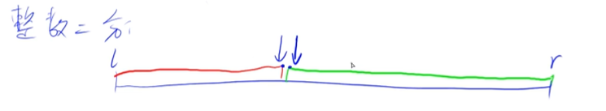
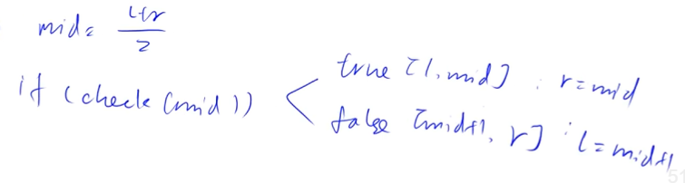
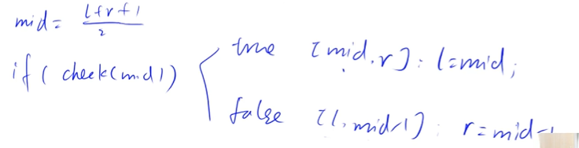

## 1. 整数二分

[AcWing 789. 数的范围](https://www.acwing.com/problem/content/791/)

### 模板

 条件：数组有序或者拥有类似于有序的性质。

```cpp
/* 计算左边界，区间[l, r]被划分成[l, mid]和[mid + 1, r]时使用 */
/* 比如：1 2 2 2 3，x = 2，res = 1 */
int bsearch(int l, int r) {
    while (l < r) {
        int mid = l + r >> 1; // 向下取整, 可以取到q[l]
        if (x <= q[mid]) r = mid;    
        else l = mid + 1;
    }
    return l;
}

/* 计算右边界，区间[l, r]被划分成[l, mid - 1]和[mid, r]时使用 */
/* 比如：1 2 2 2 3，x = 2，res = 3 */
int bsearch(int l, int r) {
    while (l < r) {
        int mid = l + r + 1 >> 1; 
        if (x >= q[mid]) l = mid;
        else r = mid - 1;
    }
    return r; // l或r都行，此时l==r
}
```

### 求边界



绿色左边界点：

+ 如果 mid 满足绿色条件，就是 $[l,mid],r = mid$
+ 如果 mid 不满足绿色条件，就是 $[mid+1,r],l = mid+1$



红色右边界点：

+ 如果 mid 满足红色条件，就是 $[mid,r],l = mid$
+ 如果 mid 不满足红色条件，就是 $[l,mid-1],r = mid-1$




## 2. 浮点数二分模板

[AcWing 790. 数的三次方根](https://www.acwing.com/problem/content/792/)

```cpp
double bsearch(double l, double r)
{
    const double eps = 1e-8; // eps表示精度，取决于题目对精度的要求，比题目要求保留的位数多2，本题要求保留6位小数，就写-8
    while (r - l > eps)
    {
        double mid = (l + r) / 2; // 浮点数不能使用 >> 
        if (x <= f(mid)) r = mid;
        else l = mid;
    }
    return l;
}
```


