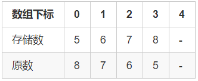

## 1. 大整数存储

数字在数组中逆序存储，假设大整数是非负数，数组 A 中 0 对应大整数的最低位（个位），n-1对应最高位

```cpp
vector<int> A;
string a;
cin >> a;
for (int i = a.size() - 1; i >= 0; i--) A.push_back(a[i] - '0');
```

## 2. 大整数比较

```cpp
// A >= B返回true，否则返回false
bool cmp(vector<int>& A, vector<int>& B) {
    if (A.size() != B.size()) return A.size() > B.size();
    for (int i = A.size() - 1; i >= 0; i--) 
        if (A[i] != B[i]) return A[i] > B[i];
    return true;
}
```

## 3. 高精度加法

[AcWing 791. 高精度加法](https://www.acwing.com/problem/content/793/)

模板假设 A 和 B 都是**非负大整数**

假设大整数 A 的位数 ≥ 大整数B，不满足要交换参数次序

大整数低位存放在数组低地址处，高位存放在数组高地址处
+ 数组地址由低到高（0→n - 1）
+ 整数位数最左边是高位，最右边是低位（高位→低位）



注意处理最高位进位

读取数组时反向(n-1→0)遍历，运算时正向(0→n-1)遍历

高精度加法不会出现前导0，而减法、乘法和除法会出现前导0

```cpp
// C = A + B, A >= 0, B >= 0
vector<int> add(vector<int> &A, vector<int> &B)
{
    // 让 A 的长度长一点
    if (A.size() < B.size()) return add(B, A);

    vector<int> C;
    int t = 0;
    for (int i = 0; i < A.size(); i ++ )
    {
        t += A[i];
        if (i < B.size()) t += B[i];
        C.push_back(t % 10);
        t /= 10; // 这个表示进位
    }

    if (t) C.push_back(t);
    return C;
}
```

## 4. 高精度减法

[AcWing 792. 高精度减法](https://www.acwing.com/problem/content/submission/794/)

模板假设 A 和 B 都是**非负大整数**，且 `A ≥ B`，可用 `cmp()` 模板判断是否满足 `A ≥ B`，不满足交换参数次序即可

`(t + 10) % 10`涵盖了 t 正负两种情况

+ `t >= 0` 输出 `t % 10`
+ `t < 0` 输出 `t + 10`

减法会产生多个前导0

去掉前导0时，注意不能把结果 0 也去掉，即需要判断 `C.size() > 1`

```cpp
/* C = A - B, 满足A >= B, A >= 0, B >= 0 */
vector<int> sub(vector<int> &A, vector<int> &B)
{
    vector<int> C;
    for (int i = 0, t = 0; i < A.size(); i ++ )
    {
        t = A[i] - t; // 这里的t表示借位，最多借1位
        if (i < B.size()) t -= B[i];
        C.push_back((t + 10) % 10); // 这一行代码是核心
        if (t < 0) t = 1;
        else t = 0;
    }

    // 消除前导0
    while (C.size() > 1 && C.back() == 0) C.pop_back(); 
    return C;
}
```

## 5. 高精度乘法

[AcWing 793. 高精度乘法](https://www.acwing.com/problem/content/795/)

模板假设 A 是非负大整数，b是基本类型int

乘法模板把对最高位的进位的处理翻到了 for 的循环条件中，这是与加法的主要区别。加法之所以能用一个 if 就能解决最高位的进位问题，是因为高精度加法最高位进位不会超过10（实际上最多是1），而高精度乘法的最高位进位可能超过10，甚至更高，因此不能像加法那样处理。

```cpp
// C = A * b, A >= 0, b > 0
vector<int> mul(vector<int> &A, int b)
{
    vector<int> C;

    int t = 0;
    for (int i = 0; i < A.size() || t; i ++ )
    {
        if (i < A.size()) t += A[i] * b;
        C.push_back(t % 10);
        t /= 10;
    }
	/* 类似9999*0=0000,需要删除前导0 */
    while (C.size() > 1 && C.back() == 0) C.pop_back();

    return C;
}
```

## 6. 高精度除法

[AcWing 794. 高精度除法](https://www.acwing.com/problem/content/796/)

模板假设 A 是非负大整数，b 是基本类型int

商用 `vector<int>` 保存，余数用参数 r 保存

除法是反向遍历（高位到低位）

结果要翻转，注意导入 `<algorithm>` 库

注意遍历时，`r = r * 10 + A[i]`；是`=`，而不是`+=`

```cpp
// A / b = C ... r, A >= 0, b > 0
vector<int> div(vector<int> &A, int b, int &r)
{
    vector<int> C;
    r = 0;
    for (int i = A.size() - 1; i >= 0; i -- )
    {
        r = r * 10 + A[i];
        C.push_back(r / b);
        r %= b;
    }
    reverse(C.begin(), C.end());
    while (C.size() > 1 && C.back() == 0) C.pop_back();
    return C;
}
```


