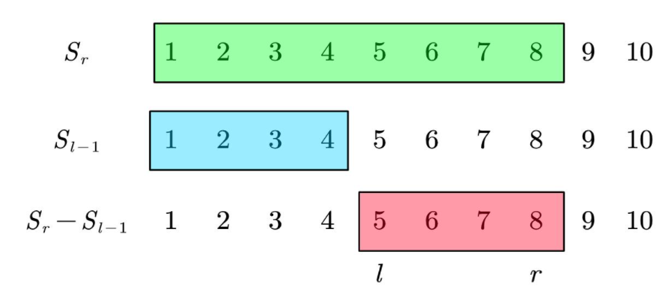
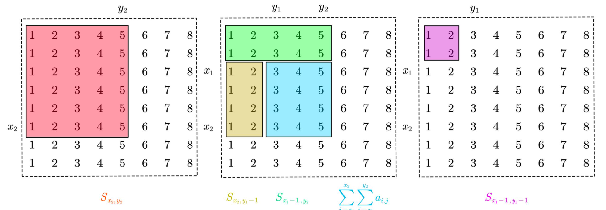

## 1. 前缀和

### 一维前缀和

[AcWing 795. 前缀和](https://www.acwing.com/problem/content/797/)

快速求出数组中一段数的和。

```cpp
int a[N], S[N];

// 前缀和数组S
// 从 a1 开始，S0 = 0
for (int i = 1; i <= n; i++) S[i] = S[i - 1] + a[i];    

// 计算a[l] + ... + a[r]
S[r] - S[l - 1];
```

假设 $S_0 = a_0 = 0$，复杂度由 $O(n)$ 降为 $O(1)$，数组 a 和 S 的第 1 个元素都不存储（下标为 0），而从第 2 个元素开始存储（下标为1）.

遍历范围是 `1 ~ n`，在一些不涉及 a[i] 的题目中，不必要存储 a[i] 的值，只需要存储 S[i] 就足够。



### 二维前缀和

[AcWing 796. 子矩阵的和](https://www.acwing.com/problem/content/798/)

求子矩阵的和。`S[i, j]` 表示第 i 行 j 列格子左上部分所有元素的和。

```cpp
int a[N][N], S[N][N];

// 前缀和数组S
for (int i = 1; i <= n; i++)
    for (int j = 1; j <= m; j++) 
        S[i][j] = S[i - 1][j] + S[i][j - 1] - S[i - 1][j - 1] + a[i][j];

// 以(x1, y1)为左上角，(x2, y2)为右下角的子矩阵的和
S[x2][y2] - S[x2][y1 - 1] - S[x1 - 1][y2] + S[x1 - 1][y1 - 1];
```
假设数组 a 中行下标或列下标为 0 的项都是0，复杂度由 $O(m * n)$ 降为 $O(1)$。

遍历范围是 `1 ~ n`，在一些不涉及 a\[i\]\[j\] 的题目中，不必存储 a\[i\]\[j\] 的值，只需要存储 S\[i\]\[j\] 就足够。



## 2. 差分

### 一维差分

[AcWing 797. 差分](https://www.acwing.com/problem/content/799/)

a 是 b 的前缀和；b 是 a 的差分。两者是逆运算。

+ $a_n=b_1+b_2+ \cdots +b_n=a_{n-1}+b_n$
+ $b_n=a_n-a_{n-1}$

作用：中间一段数组发生了变化，输出发生变化后的序列。

```cpp
int a[N], B[N];

// 核心代码，给区间[l, r]中的每个数加上c
void insert(int l, int r, int c) {
    B[l] += c;
    B[r + 1] -= c;
}

// 初始化差分数组b
for (int i = 1; i <= n; i++) {
    scanf("%d", &a[i]);
    insert(i, i, a[i]);
}

// 输出前缀和数组a,(经过变换后的矩阵)
for (int i = 1; i <= n; i++) {
    B[i] += B[i - 1];
    printf("%d ", B[i]);
}
```

用 `insert(i, i, a[i])​` 与 `B[i] = a[i]` 初始化差分数组的区别在于，前者构造的差分数组 B[n] 等于-B[n - 1]，而后者等于 0。

读入数组 a 和初始化差分数组 B 的过程可以合并在一起，注意遍历范围是 `1 ~ n`，在一些不涉及 a[i] 的题目中，不必要存储 a[i] 的值，只需要存储 B[i] 就足够。

### 二维差分

[AcWing 798. 差分矩阵](https://www.acwing.com/problem/content/800/)

```cpp
int B[N][N]; 

// 核心代码，给以(x1, y1)为左上角，(x2, y2)为右下角的子矩阵中的所有元素加上c
void insert(int x1, int y1, int x2, int y2, int c) {
    B[x1][y1] += c;
    B[x2 + 1][y1] -= c;
    B[x1][y2 + 1] -= c;
    B[x2 + 1][y2 + 1] += c;
}

// 构造差分矩阵b
int tmp;
for (int i = 1; i <= n; i++) {
    for (int j = 1; j <= m; j++) {
        scanf("%d", &tmp);
        insert(i, j, i, j, tmp);
    }
}

// 输出前缀和数组a,(经过变换后的矩阵)
for (int i = 1; i <= n; i++)
    for (int j = 1; j <= m; j++)
        B[i][j] += B[i - 1][j] + B[i][j - 1] - B[i - 1][j - 1];
```

其中一个子矩阵发生了变化，求出发生了变化后的矩阵。

## 总结

前缀和数组、差分数组的区别

+ 差分无需构造，前缀和需构造
+ 前缀和场景：数组固定，做大量求和的询问。
+ 差分场景：做区间加减，最后给出改变后的数组。
