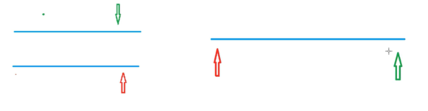

## 双指针

[AcWIng 799. 最长连续不重复子序列](https://www.acwing.com/problem/content/801/)

[AcWing 800. 数组元素的目标和](https://www.acwing.com/problem/content/802/)

[AcWing 2816. 判断子序列](https://www.acwing.com/problem/content/2818/)

核心思想：将朴素的双重循环优化到 $O(n)$。将上一状态指针所表达的信息传递至下一状态，从而减少无谓的搜索。

常见问题分类：
+ 对于一个序列，用两个指针维护一段区间，例如快排。
+ 对于两个序列，维护某种次序，比如归并排序中合并两个有序序列的操作。



```cpp
for (int i = 0, j = 0; i < n; i++ ) {
    while (j < i && check(i, j)) j++ ;
    // 具体问题的逻辑
}
```

双指针算法会把序列分成3段，理解各段的含义很重要（尤其第2段）
+ 第1段：`0 ~ j - 1`
+ 第2段：`j ~ i`
+ 第3段：`i + 1 ~ n - 1`


