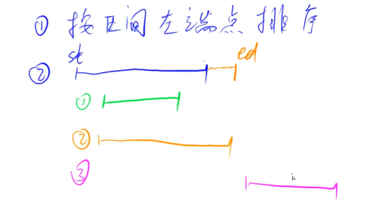

### 区间合并

[AcWing 803. 区间合并](https://www.acwing.com/problem/content/805/)

将有交集的区间进行合并，如果在端点处相交，也算有交集。例如：\[1,3] 和 [2,6] 可以合并为一个区间 [1,6]。

先按左端点排序，然后再合并。

选取第2个区间时，可分为两大类情况：
+ 有交集（包括“包含”和“相交但不包含”两种情况），只需保留最大的右端点即可。
+ 无交集，首先判断是否是空区间（st == -2e9），非空则保存当前区间，并跳至下一个区间。

由于循环内部是先发现新的无交集区间才保存当前指向的区间，因此在循环结束后，还需要单独保存当前区间（注意判断是否为空区间）。



```cpp
/* 将所有存在交集的区间合并 */
void merge(vector<PII> &segs)
{
    vector<PII> res;

    sort(segs.begin(), segs.end());

    int st = -2e9, ed = -2e9;
    for (auto seg : segs)
        if (ed < seg.first)
        {
            if (st != -2e9) res.push_back({st, ed});
            st = seg.first, ed = seg.second;
        }
        else ed = max(ed, seg.second);

    // 最后一个大区间，同时避免没有区间
    if (st != -2e9) res.push_back({st, ed});

    segs = res;
}
```

