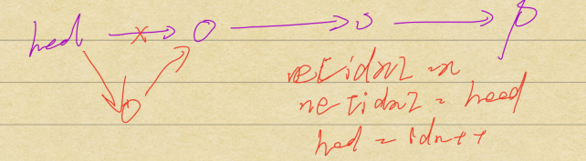
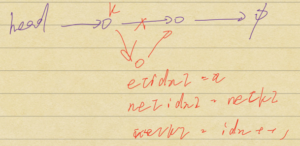
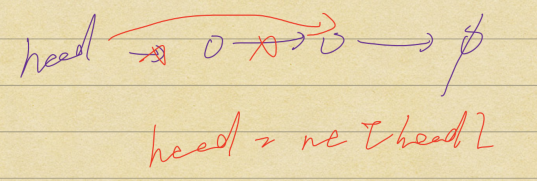
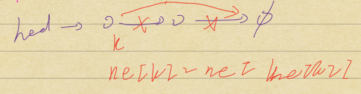
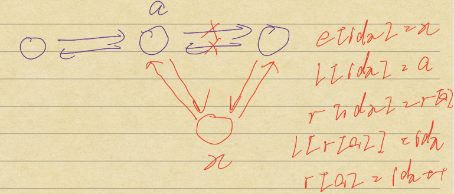
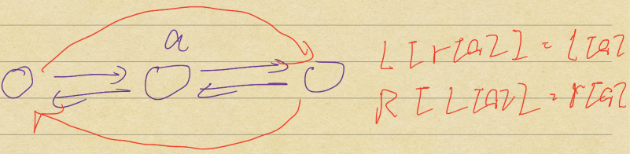

[toc]

### 1. 单链表

 [AcWing 826. 单链表](https://www.acwing.com/problem/content/828/)

#### 1. 1 模板

+ 头节点有值，head 表示头节点的指针。
+ 尾节点的 ne[*] 是 -1。

```cpp
// head存储链表头，e[]存储节点的值，ne[]存储节点的next指针，idx表示当前用到了哪个节点
int head, e[N], ne[N], idx;

// 初始化
void init()
{
    head = -1; // 会一直保留到最后，便于遍历结束
    idx = 0;
}

// 在链表头插入一个数x
void insert(int x)
{
    e[idx] = x, ne[idx] = head, head = idx ++ ;
}

// 将头结点删除，需要保证头结点存在
void remove()
{
    head = ne[head];
}

// 将x插到下标是k的点后面
void add(int k, int x)
{
    e[idx] = x, ne[idx] = ne[k], ne[k] = idx ++ ;
}

// 将下标是k的点后面的点删掉，伪删除，实际没有删除，所以下标没有发生变化
void remove(int k)
{
    ne[k] = ne[ne[k]];
}

// 遍历
for (int i = head; i != -1; i = ne[i])
{
	cout << e[i] << endl;
}
```

#### 1.2 插入头节点



#### 1.3 插入中间节点



#### 1.4 删除头节点



#### 1.5 删除节点




### 2. 双链表

 [AcWing 827. 双链表](https://www.acwing.com/problem/content/829/)

#### 2.1 模板

+ 0 表示左端点，1 表示右端点。
+ 0 和 1 一直都是一个空的头尾节点，真正的双链表内容在 0 和 1 之间。
+ `insert(int a, int x) ` 表示在 **a 位置右边**插入数 x。
+ `insert(l[a], x)` 表示在 **a 位置左边**插入数 x。
+ `insert(0, x)` 表示在**最左边**插入数 x。
+ `insert(l[1], x)` 表示在**最右边**插入数 x。

```cpp
// e[]表示节点的值，l[]表示节点的左指针，r[]表示节点的右指针，idx表示当前用到了哪个节点
int e[N], l[N], r[N], idx;

// 初始化
void init()
{
    //0是左端点，1是右端点
    r[0] = 1, l[1] = 0;
    idx = 2;
}

// 在节点a的右边插入一个数x
void insert(int a, int x)
{
    e[idx] = x;
    l[idx] = a, r[idx] = r[a];
    l[r[a]] = idx, r[a] = idx ++ ;
}

// 删除节点a
void remove(int a)
{
    l[r[a]] = l[a];
    r[l[a]] = r[a];
}

for (int i = r[0]; i != 1; i = r[i])
{
    cout << e[i] << " ";
}
```

#### 2.2 插入一个数



#### 2.3 删除一个节点




### 3. 翻转链表

[AcWing 35. 反转链表](https://www.acwing.com/problem/content/33/)

[LeetCode 92. 反转链表 II](https://leetcode-cn.com/problems/reverse-linked-list-ii/)

#### 3.1 动图模拟


#### 3.2 模板

```cpp
struct ListNode
{
    int val;
    ListNode *next;
    ListNode(int x) : val(x), next(NULL) {}
};

class Solution
{
public:
    // 迭代实现
    ListNode *reverseList(ListNode *head)
    {
        ListNode *pre = nullptr; // 前驱节点
        ListNode *cur = head; // 当前节点
        while (cur)
        {
            ListNode *next = cur->next; // 后继节点
            cur->next = pre; // 反转
            pre = cur; // 前驱变成当前节点
            cur = next; // 当前节点位移到下一个 
        }
        return pre;
    }

    // 递归实现，reverseList 函数能做什么，它可以翻转一个链表，并返回新链表的头节点，也就是原链表的尾节点。
    ListNode *reverseList2(ListNode *head)
    {
        if (!head || !head->next) return head; // 空节点或者只有一个节点
        ListNode *tail = reverseList2(head->next); // 以head->next为头节点的链表翻转，并得到原链表的尾节点tail
        
        // head->next是新链表的尾节点
        head->next->next = head;
        head->next = nullptr; // head->next指向空即可将整个链表翻转
        return tail;
    }
};
```

