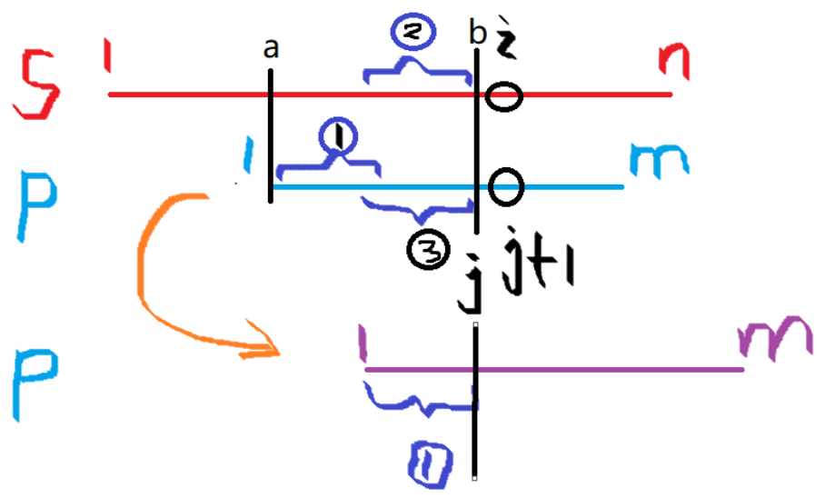

### 1. KMP

[AcWing 831. KMP字符串](https://www.acwing.com/problem/content/833/)

```cpp
// s[]是文本串，p[]是模式串，m是s[]的长度，n是p[]的长度，ne[]是 next 数组
const int N = 10010, M = 100010;
int n, m, ne[N];
char p[N], s[M];

// p 和 s 从下标 1 开始读取字符串
cin >> n >> p + 1 >> m >> s + 1; 

// 求模式串p的 next 数组, i 从 2 开始，因为 next[1] = 0。
// 核心：求next数组的过程和kmp匹配的过程类似，只不过文本串和模式串相等，每一次比较的都是 p[i] 和 p[j+1]。
for (int i = 2, j = 0; i <= n; i ++ )
{
    // 这里的j有前一轮的影响，也即是之前已经匹配了的下标，下一步如果不匹配，就从0k
    while (j && p[i] != p[j + 1]) j = ne[j];
    if (p[i] == p[j + 1]) j ++ ;
    ne[i] = j;
}

// kmp匹配，为了方便码代码，i = 1, j = 0，每一次比较的都是 s[i] 和 p[j+1]。
for (int i = 1, j = 0; i <= m; i ++ )
{
    // 核心代码：下标 i 之前的字符都已成功匹配了，下标 i 不匹配，就回退 j，一直不匹配就一直回退到 j = 0，开始重新匹配。
    while (j && s[i] != p[j + 1]) j = ne[j];
    
    // 成功匹配，j 就可以移动到下一个地方
    if (s[i] == p[j + 1]) j ++ ;
    
    // 匹配成功
    if (j == n)
    {
        j = ne[j];
        // 成功后的逻辑
    }
}
```

### 2. KMP是什么，做什么用的

KMP全称为 Knuth Morris Pratt 算法，三个单词分别是三个作者的名字。

KMP是一种高效的字符串匹配算法，用来在主字符串中查找模式字符串的位置。

**经典运用：求循环节。**

写出前缀表：


开始匹配：


### 3. 计算 next 数组

next 数组的含义：用来存模式串中每个前缀最长的能匹配前缀子串的结尾字符的下标。next[i] 的定义是非平凡的最大后缀等于最大前缀，next[i] 必须要小于 i。

我们为了方便，下标从 1 开始。 

$next[i] = j$ 表示下标以 $i-j+1$ 为起点，i 为终点的**后缀**和下标以 1 为起点，j 为终点的**前缀**相等，且此字符串的长度最长。

用符号表示为 $p[1 , j] == p[i-j+1 , i]$。

当下标从 1 开始时，我们发现，j 就是最长前缀的长度。


下面以 ”ababacd” 模式串为例，给出这个串的 next 数组，下标从 1 开始。

| 模式前缀 | 前缀结尾下标 | 最长能匹配前缀子串结尾字符的下标 | next数组的取值 |    匹配情况     |
| :------: | :----------: | :------------------------------: | :------------: | :-------------: |
|    a     |      1       |                0                 |  next[1] = 0   |       无        |
|    ab    |      2       |                0                 |  next[2] = 0   |       无        |
|   aba    |      3       |                1                 |  next[3] = 1   |   p[3]==p[1]    |
|   abab   |      4       |                2                 |  next[4] = 2   | p[3:4]\==p[1:2] |
|  ababa   |      5       |                3                 |  next[5] = 3   | p[3:5]==p[1:3]  |
|  ababac  |      6       |                0                 |  next[6] = 0   |       无        |

s 串 和 p 串都是从 1 开始的。i  从 1 开始，j 从 0 开始，每次s[ i ] 和p[ j + 1 ]比较。



s[ a, b ] = p[ 1, j ]  &&  s[ i ] != p[ j + 1 ]， 此时要移动 p 串（不是移动1格，而是直接移动到下次能匹配的位置）。

其中 1 串为[1, next[ j ] ]，3串为[ j - next[ j ] + 1 , j ]。由匹配可知 1 串等于 3 串，3 串等于 2 串。所以直接移动 p 串使 1 到 3 的位置即可。这个操作可由 j = next[ j ] 直接完成。 如此往复下去，当 j == m时匹配成功。

其实 p 串没有移动，只是将 j 指针向前移动了。

```cpp
//求模式串的 next 数组, i 从 2 开始，因为 next[1] = 0
for (int i = 2, j = 0; i <= n; i ++ )
{
    while (j && p[i] != p[j + 1]) j = ne[j];
    if (p[i] == p[j + 1]) j ++ ;
    ne[i] = j;
}
```


### 4. KMP的时间复杂度

KMP的时间复杂度是$O(n)$。