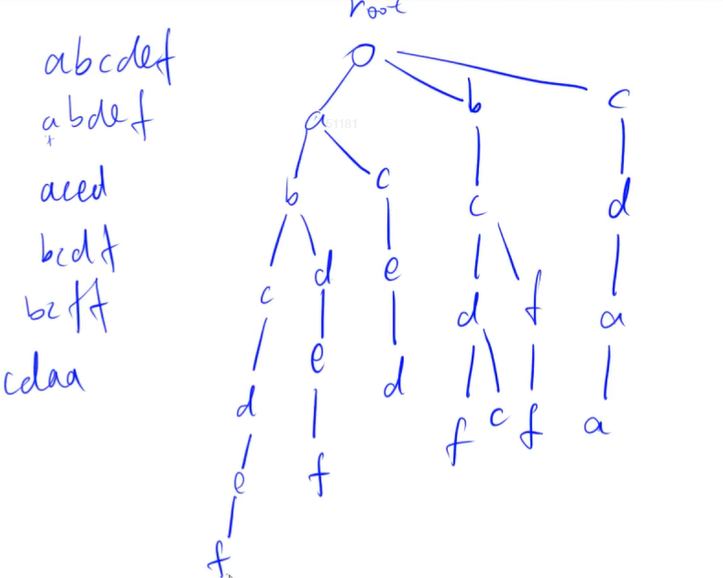

### 1. Trie树 

[AcWing 835. Trie字符串统计](https://www.acwing.com/problem/content/837/)

```cpp
int son[N][26], cnt[N], idx;
// 0号点既是根节点，又是空节点
// son[][]存储树中每个节点的子节点的指针
// cnt[]存储以每个节点结尾的单词数量

// 插入一个字符串
void insert(char *str)
{
    // p是指针，表示当前字符串中遍历的位置
    int p = 0;
    // 字符串结尾是 0，可以表示用来循环判断结束条件
    for (int i = 0; str[i]; i ++ )
    {
        // 寻找下一个节点的位置
        int u = str[i] - 'a';
        //节点不存在，产生新的节点
        if (!son[p][u]) son[p][u] = ++ idx;
        // p指针移动
        p = son[p][u];
    }
    cnt[p] ++ ;
}

// 查询字符串出现的次数
int query(char *str)
{
    // 设置查询指针
    int p = 0;
    for (int i = 0; str[i]; i ++ )
    {
        // 下一个节点的位置
        int u = str[i] - 'a';
        // 中间某一个节点不存在，返回0，y
        if (!son[p][u]) return 0;
        // 中间某一个节点存在，p指针移动到下一位
        p = son[p][u];
    }
    return cnt[p];
}
```

+ Trie树共享前缀，结点存在不代表根到该结点的字符串存在，需要看标记数组cnt。
+ Trie树是多重集合。
+ son数组的第 1 维表示结点地址，要大于所有存储的字符串长度的和（不是字符串长度的最大值）；第2维表示每个结点的最大分支数，一般取字符种类数（如小写字母有26个）。
+ cnt[i] 表示以 son[i] 结点为末尾的字符串的个数。

### 2. 什么是字典树

字典树：高效地存储和查找字符串的数据结构。



### 3. idx 的作用

在这一章节中，我们看到在实现各种数据结构中经常用到 idx 这个变量，这个变量到底有什么用呢？为什么链表，Trie 树和堆会用到 idx 来维护这个数据结构，而栈和队列就不用 idx 来维护，而是用 hh 和 tt 来维护呢？

不管是链表，Trie 树还是堆，他们的基本单元都是一个个结点连接构成的，可以成为“链”式结构。这个结点包含两个基本的属性：本身的值和指向下一个结点的指针。按道理，应该按照结构体的方式来实现这些数据结构的，但是做算法题一般用数组模拟，主要是因为比较快。

那就有个问题，原来这两个属性都是以结构体的方式联系在一起的，现在如果用数组模拟，如何才能把这两个属性联系起来呢，如何区分各个结点呢？

这就需要用到 idx 了，idx 的操作总是 idx++，这就保证了不同的 idx 值对应不同的结点。因此可以利用 idx 把结构体内两个属性联系在一起了。因此，idx 可以理解为结点。

### 4. son\[N][26] 的作用

Trie 树中有个二维数组 `son[N][26]`，表示当前结点的儿子，如果没有的话，可以等于 ++idx。Trie 树本质上是一颗多叉树，对于字母而言最多有 26 个子结点。所以这个数组包含了两条信息。

比如：`son[1][0]=2` 表示 1 结点的一个值为 a 的子结点为结点2。如果 `son[1][0] `= 0，则意味着没有值为 a 子结点。

这里的`son[N][26]`相当于链表中的 ne[N]。

