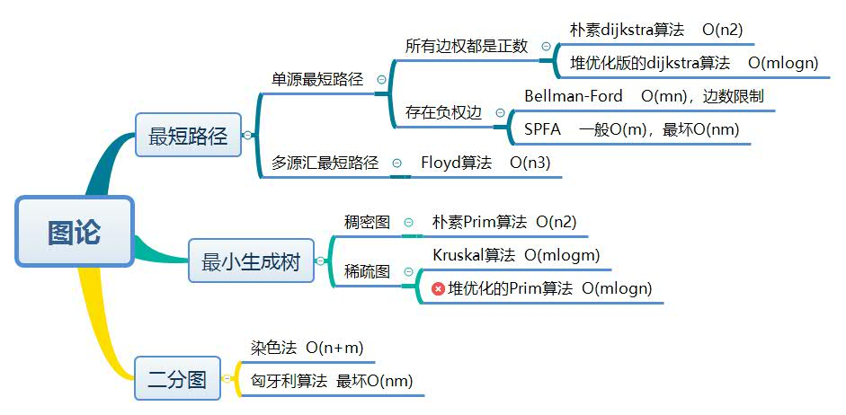
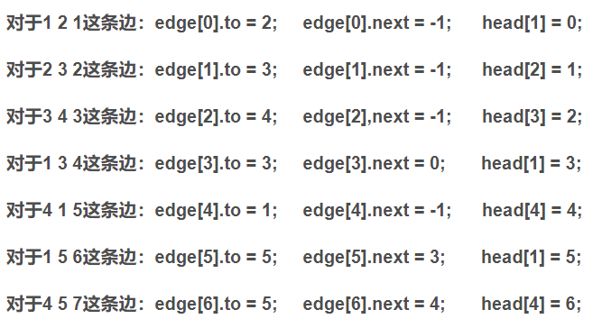
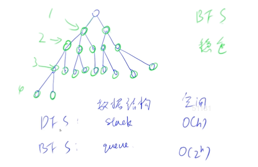
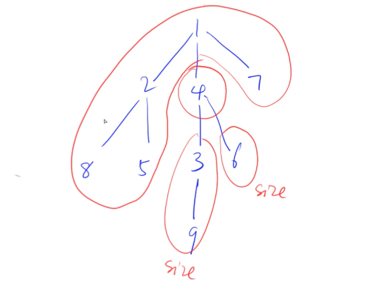

[toc]



## 树和图的存储与遍历

### 1. 树和图的存储

+ 树是一种特殊的图，与图的存储方式相同。
+ 对于无向图中的边ab，存储两条有向边a->b, b->a。
+ 因此我们可以只考虑有向图的存储。

#### 1.1 邻接矩阵

`g[a][b]` ：存储边a->b

#### 1.2 邻接表

```cpp
// 对于每个点k，开一个单链表，存储k所有可以走到的点。h[k]存储这个单链表的头结点
int h[N], e[N], ne[N], idx;

// 添加一条边a->b
void add(int a, int b)
{
    // 对于边 <u, v1>, <u, v2>
	// idx 是边的指针
    e[idx] = b;// e[idx] 是边的右边的点v1
    ne[idx] = h[a];// // ne[idx] 是边<u, v2>的指针
    h[a] = idx ++ ; // h[u] 是头指针，保存边<u, v1>的指针
}

// 初始化
idx = 0;
memset(h, -1, sizeof h);
```




### 2. 树和图的遍历

时间复杂度 $O(n+m)$，n 表示点数，m 表示边数。



#### 2.1 深度优先遍历

[AcWing 842. 排列数字](https://www.acwing.com/problem/content/844/)

[AcWing 846. 树的重心](https://www.acwing.com/problem/content/848/)

[AcWing 843. n-皇后问题](https://www.acwing.com/problem/content/845/)

+ 空间复杂度为O(h)，对空间复杂度高的考虑DFS
+ 不具备**最短性**

```cpp
/* 
模板1，这个模板应该是最常用的了，一般返回值是void，
场景：有固定数量的状态，for (int i = 0; i < n; i++) 
*/

bool st[N];         // 标记是否用过
int h[N], ne[N];

void dfs(int u)
{
    if (u == n) // 到 n 结束
    {
        ...; 
        return;
    } 
   
    for (int i = 0; i < n; i++)
    {
        if (!st[i]){
            st[i] = true;
            dfs(u + 1);
            st[i] = false;      // 恢复现场，回溯
        } 
    } 
}

int main()
{
	...
    dfs(0); // 一般从0开始
    ...
    return 0;
}
```

```cpp
/* 模板2，场景：树形结构的遍历，一般返回值是int，它的意义是返回当前子树的某个性质，比如子树的j */

int dfs(int u)
{
    st[u] = true; // st[u] 表示点u已经被遍历过，最重要的性质是，保证了接下来只会遍历当前节点的子节点，而不会遍历父节点

    for (int i = h[u]; i != -1; i = ne[i])
    {
        int j = e[i];
        if (!st[j]) dfs(j);
    }
}

int main()
{
	...
    dfs(1); // 一般从1开始，1是根节点
    ...
    return 0;
}
```



#### 2.2 宽度优先遍历

[AcWing 847. 图中点的层次](https://www.acwing.com/problem/content/849/)

[AcWing 845. 八数码](https://www.acwing.com/problem/content/847/)

[AcWing 844. 走迷宫](https://www.acwing.com/problem/content/846/)

+ 如果手动实现queue，则容量一般取N * N
+ BFS只适用边权为1的迷宫
+ BFS的优点：第一次扩展到的点是"最短路"。（最短路、最小次数的一些问题使用BFS）
+ 时间复杂度 O(n+m), n 表示点数，m 表示边数

```cpp
/* 思路模板 */
int bfs(){
    queue<int> q;
    st[1] = true; // 表示1号点已经被遍历过
    q.push(1);

    while (q.size())
    {
        int t = q.front();
        q.pop();

        for (int i = h[t]; i != -1; i = ne[i])
        {
            int j = e[i];
            if (!st[j])
            {
                st[j] = true; // 表示点j已经被遍历过
                q.push(j);
            }
        }
    }
}
```

```cpp
/* 常用模板 */
int bfs() // 一般是没有传入参数的
{
    queue<int> q;
    q.push(1);
    d[1] = 0; // 使用d代替st的作用，同时还有维护距离的意思，有需要的话，使用memset复赋值-1

    while (q.size())
    {
        int t = q.front();
        q.pop();
        for (int i = h[t]; i != -1; i = ne[i])
        {
            int j = e[i];
            if (d[j] == -1)
            {
                d[j] = d[t] + 1;
                q.push(j);
            }
        }
    }
    
    return d[n]; // 有返回值的话，大多是都是返回d[n]
}
```

