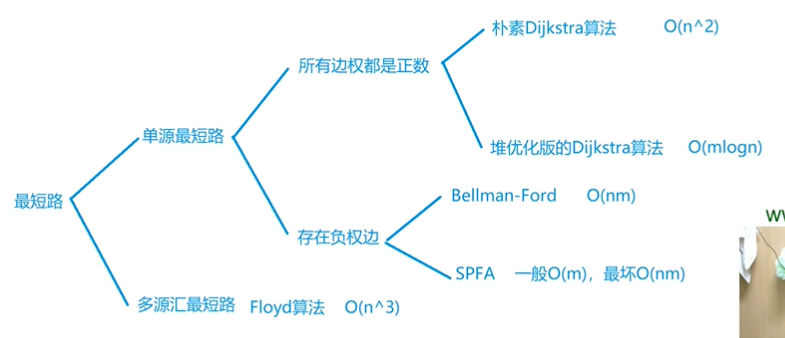
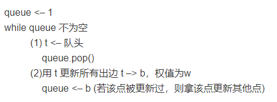

[toc]

## 最短路

### 1. 综述



+ 都是正权边——使用`Dijkstra`；有负权，但是没有负权环——使用`spfa`；有**负权环**，或者要求最短路径不超过k条边——使用`Bellman-Ford`。
+ 大多数情况下，**优先使用`spfa`**；如果数据被卡了，换成`Dijkstra`l；如果规定不超过 k 条边或者存在负权环，只能使用 BF 算法。
+ `Dijkstra`的选择：如果点的数量小于1000，使用朴素算法；如果点的数量大于1000，就用优化算法。
+ 负权环：源点到源点的一个环，环上权重和为负数。一般使用 **`spfa`**判断负权环。
+ 只有朴素 `dijkstra` 使用二维数组，其他都使用链式前向星。
+ 只有BF算法使用结构体、backup数组和。
+ 只有堆优化 `dijkstra` 使用 `priority_queue`；
+ 只有使用 `spfa` 判断负环不用初始化dist数组，其他都要进行**dist[1] = 0, dist[i] = inf**。
+ 需要`inf / 2`有BF算法和 `floyd` 算法。


### 2. 单源最短路

#### 2.1 朴素 `dijkstra`

[AcWing 849. Dijkstra求最短路 I](https://www.acwing.com/problem/content/851/)

+ 时间复杂是 **O(n<sup>2</sup>+m)**，n 表示点数，m 表示边数
+ 不能有负边 
+ 初始化距离数组, **dist[1] = 0, dist[i] = inf**，确保第一个点是原点。
+ n次循环，每次循环确定一个不在 S 集合中的 **dist 最小的顶点**加入 S 集合中。
+ **存在重边的情况的话，选择最小的权值来存储。**
+ 朴素做法，每个顶点都扫描一遍。

```cpp
int g[N][N];  // 存储每条边
int dist[N];  // 存储1号点到每个点的最短距离
bool st[N];   // 存储每个点的最短路是否已经确定

// 求1号点到n号点的最短路，如果不存在则返回-1
int dijkstra()
{
    // 初始的时候dist设置为无穷大
    memset(dist, 0x3f, sizeof dist);
    // 一号点的距离设置成0
    dist[1] = 0;
	
    for (int i = 0; i < n ; i ++ )
    {
        // t表示不在集合S中的距离原点最小的点
        int t = -1; 
        // 朴素做法，每个顶点都扫描一遍
        for (int j = 1; j <= n; j ++ )
            if (!st[j] && (t == -1 || dist[t] > dist[j]))
                t = j;
        // 将顶点t加入集合
 		st[t] = true;
        
        // 用t更新其他点的距离
        for (int j = 1; j <= n; j ++ )
            dist[j] = min(dist[j], dist[t] + g[t][j]);
    }

    if (dist[n] == 0x3f3f3f3f) return -1;
    return dist[n];
}

int main()
{
    
    // ...
    
    // 初始化地图，将地图的权值最大化
    memset(g, 0x3f, sizeof g);
    
    for (int i = 0; i < m; i++)
    {
        scanf("%d%d%d", &u, &v, &w);
        // 对于重边的情况，我们选择最小边
        g[u][v] = min(w, g[u][v]);
    }
    
    // ...
    
    return 0;
}
```

#### 2.2 堆优化 `dijkstra`

[AcWing 850. Dijkstra求最短路 II](https://www.acwing.com/problem/content/852/)

+ 时间复杂度 $O(mlogn)$，n表示点数，m表示边数
+ 不能有负边
+ **优化方式：链式前向星 + 优先队列**
+ 利用堆顶来更新其他点，并加入堆中。
+ 初始化距离数组, **dist[1] = 0, dist[i] = inf**，确保第一个点是原点。
+ **队列中顶点会重复，注意使用continue。原因：如果出现重边，同一个顶点在一次遍历可能会出现多次。**
+ 就是一个`bfs`。

```cpp
typedef pair<int, int> PII;

int n;      // 点的数量
int h[N], w[N], e[N], ne[N], idx;       // 链式前向星
int dist[N];        // 存储所有点到1号点的距离
bool st[N];     // 存储每个点的最短距离是否已确定

// 求1号点到n号点的最短距离，如果不存在，则返回-1
int dijkstra()
{
    // 初始化距离数组dist
    memset(dist, 0x3f, sizeof dist);
    // 给 1 号点写上距离 0
    dist[1] = 0;
    // 初始化堆
    priority_queue<PII, vector<PII>, greater<PII>> heap;
    // first存储距离，second存储节点编号，pair比较的时候，默认先比较第一个
    heap.push({0, 1});      

    while (heap.size())
    {
        auto t = heap.top();
        heap.pop();

        int ver = t.second, distance = t.first;

        // 因为上几轮重复加入了几次ver顶点的更新，遇到这种情况就要continue
        if (st[ver]) continue;
        // 如果ver顶点第一次更新，那么就需要标记加入S集合
        st[ver] = true;

        // i是边的地址
        for (int i = h[ver]; i != -1; i = ne[i])
        {
            int j = e[i];
            if (dist[j] > distance + w[i])
            {
                // 更新j节点，加入堆
                dist[j] = distance + w[i];
                heap.push({dist[j], j});
            }
        }
    }

    if (dist[n] == 0x3f3f3f3f) return -1;
    return dist[n];
}


int main()
{
    memset(h, -1, sizeof h);
    scanf("%d%d", &n, &m);
    int u, v, c;
    for (int i = 0; i < m; i++)
    {
        scanf("%d%d%d", &u, &v, &c);
        add(u, v, c);
    }
    cout << Dijkstra() << endl;
    return 0;
}
```

#### 2.3 `Bellman-Ford`

[AcWing 853. 有边数限制的最短路](https://www.acwing.com/problem/content/855/)

+ 时间复杂度 O(nm), n 表示点数，m 表示边数
+ 迭代k的含义：从点1经过不超过k条边到其他各点的最短路径
+ **允许负权边和负权环**
+ 可以判断负环，但是一般使用 `spfa` 判断
+ **特殊题型：不超过k(k<n)条边的最短路径，需要使用备份数组**
+ 注意连锁现象需要备份
+ 初始化距离数组, **dist[1] = 0, dist[i] = inf**，确保第一个点是原点。
+ 松弛 k 次，每次访问 m 条边，**dist[x.b] = min(dist[x.b], backup[x.a] + x.w);**
+ 只有BF算法需要考虑 **dist[n] > 0x3f3f3f3f / 2**，这是因为负权回路的存在，导致边权被微小修改。


```cpp
/* 注意在模板题中需要对下面的模板稍作修改，加上备份数组。这里是没问题滴，一般的最短路问题中不需要备份距离数组，只有当有边数限制时才需要，详情见模板题。 */ 

int n, m;       // n表示点数，m表示边数
int dist[N];        // dist[x]存储1到x的最短路距离

struct Edge     // 边，a表示出点，b表示入点，w表示边的权重
{
    int a, b, w;
}edges[M];

// 求 1 到 n 的最短路距离，如果无法从 1 走到 n，则返回 -1。
int bellman_ford()
{
    memset(dist, 0x3f, sizeof dist);
    dist[1] = 0;

    // 如果第n次迭代仍然会松弛三角不等式，就说明存在一条长度是n+1的最短路径，由抽屉原理，路径中至少存在两个相同的点，说明图中存在负权回路。
    for (int i = 0; i < n; i ++ )//n次循环
    {
        for (int j = 0; j < m; j ++ )//循环边，松弛
        {
            int a = edges[j].a, b = edges[j].b, w = edges[j].w;
            dist[b] = min(dist[b], dist[a] + w) // 核心
        }
    }

    if (dist[n] > 0x3f3f3f3f / 2) return -1;// inf会被微小修改，需要这么判断是否inf
    return dist[n];
}
```

```cpp
/*
* 对于有边数限制的题目（最多经过k条边的问题），只能使用BF算法，需要备份数组
* 增加一个备份数组, memcpy(backup, dist, sizeof(dist));效率还行
*/

#include<iostream>
#include<algorithm>
#include<cstring>
using namespace std; 

const int N = 510, M = 10005;
int dist[N], n, m, k, backup[N];
struct Edge {
	int u, v, w;
}e[M];

int BellmanFord() {
	memset(dist, 0x3f, sizeof(dist));
	dist[1] = 0;
	for (int i = 0; i < k; i++) { // 这里的k是重点，k次松弛
		memcpy(backup, dist, sizeof(dist)); // 这个不要忘记了
		for (int j = 0; j < m; j++) {
			int u = e[j].u, v = e[j].v, w = e[j].w;
			dist[v] = min(dist[v], backup[u] + w);
		}
	}
	if (dist[n] > 0x3f3f3f3f / 2) return -1;// inf会被微小修改，需要这么判断是否inf
	return dist[n];
}

int main() {
	cin >> n >> m >> k;
	for (int i = 0; i < m; i++) {
		int x, y, z;
		cin >> x >> y >> z;
		e[i] = {x, y, z};
	}
	int ans = BellmanFord();
	if (ans == -1) cout << "impossible";
	else cout << ans;
	return 0;
}
```

#### 2.4 `spfa`

[AcWing 851. spfa求最短路](https://www.acwing.com/problem/content/853/)

+ 队列优化的 `Bellman-Ford` 算法
+ **只要没有负环**，就可以使用 `spfa`
+ 平均情况下 $O(m)$，最坏情况下 $O(nm)$, n 表示点数，m 表示边数
+ **很容易忘记的地方：st[u]很容易忘记**
+ 算法过程：



```cpp
int n;      // 总点数
int h[N], w[N], e[N], ne[N], idx;       // 邻接表存储所有边
int dist[N];        // 存储每个点到1号点的最短距离
bool st[N];     // 存储每个点是否在队列中

// 求 1 号点到 n 号点的最短路距离，如果从 1 号点无法走到 n 号点则返回-1
int spfa()
{
    memset(dist, 0x3f, sizeof dist);
    dist[1] = 0;

    queue<int> q;
    q.push(1);
    st[1] = true;

    while (q.size())
    {
        auto t = q.front();
        q.pop();

        st[t] = false; // 已出队，因此队列不再包含顶点t，需要重置为false，这里是重点，很容易错

        for (int i = h[t]; i != -1; i = ne[i])
        {
            int j = e[i];
            if (dist[j] > dist[t] + w[i])
            {
                dist[j] = dist[t] + w[i];
                if (!st[j])     // 如果队列中已存在j，则不需要将j重复插入
                {
                    q.push(j);
                    st[j] = true;
                }
            }
        }
    }

    if (dist[n] == 0x3f3f3f3f) return -1; // 如果题目保证不存在负权回路（不是指负权边），则可这么写
    return dist[n];
}
```

#### 2.5 `spfa` 判断负环

[AcWing 852. spfa判断负环](https://www.acwing.com/problem/content/854/)

+ 时间复杂度 O(nm), n 表示点数，m 表示边数
+ 若要判断负环，则需要额外维护一个数组`cnt`，用于记录各个最短路径的边数，当边数 ≥ 顶点数 n 时，则一定存在负环
+ 利用队列优化仅加入修改过的地方
+ for k次
+ for 所有边利用宽搜模型去优化 bellman_ford 算法
+ 更新队列中当前点的所有出边
+  原理：如果某条最短路径上有n个点（除了自己），那么加上自己之后一共有n+1个点，由抽屉原理一定有两个点相同，所以存在环。

```cpp
int n;      // 总点数
int h[N], w[N], e[N], ne[N], idx;       // 邻接表存储所有边
int dist[N], cnt[N];        // dist[x]存储1号点到x的最短距离，cnt[x]存储1到x的最短路中经过的点数
bool st[N];     // 存储每个点是否在队列中

// 如果存在负环，则返回true，否则返回false。
bool spfa()
{
    // 可以不初始化dist数组，因为我们只需要判断cnt
    //memset(dist, 0x3f, sizeof dist);
    /dist[s] = 0;

    queue<int> q;
    for (int i = 1; i <= n; i ++ )
    {
        q.push(i);
        st[i] = true;
    }

    while (q.size())
    {
        auto t = q.front();
        q.pop();

        st[t] = false; // 重点，很容易忘记

        for (int i = h[t]; i != -1; i = ne[i])
        {
            int j = e[i];
            if (dist[j] > dist[t] + w[i])
            {
                dist[j] = dist[t] + w[i]; // 松弛
                cnt[j] = cnt[t] + 1; // d
                if (cnt[j] >= n) return true;   // 如果从1号点到x的最短路中包含至少n个点（不包括自己），则说明存在环
                if (!st[j]) // 这里也很容易忘记
                {
                    q.push(j);
                    st[j] = true;
                }
            }
        }
    }

    return false;
}
```


### 3. 多源最短路

#### 3.1 floyd算法

[AcWing 854. Floyd求最短路](https://www.acwing.com/problem/content/856/)

+ 时间复杂度是 $O(n^3)$, n 表示点数
+ 初始化 d
+ k, i, j 去更新d

```cpp
const int INF = 1E9;

// 初始化：
for (int i = 1; i <= n; i ++ )
    for (int j = 1; j <= n; j ++ )
        if (i == j) d[i][j] = 0;
		else d[i][j] = INF;

// 算法结束后，d[a][b]表示a到b的最短距离
void floyd()
{
    for (int k = 1; k <= n; k ++ )
        for (int i = 1; i <= n; i ++ )
            for (int j = 1; j <= n; j ++ )
                d[i][j] = min(d[i][j], d[i][k] + d[k][j]);
}


int main()
{
	...
    
    while (m--)
    {
        scanf("%d%d%d", &a, &b, &c);
        d[a][b] = min(d[a][b], c); // 易错，图中可能存在重边和自环，选最小的
    }

	...

    while (q--)
    {
        scanf("%d%d", &a, &b);
        if(d[a][b] > inf / 2) puts("impossible"); // 并非是if(t == inf)判断，因为inf是一个确定的值，并非真正的无穷大，会随着其他数值而受到影响，t大于某个与inf相同数量级的数即可
        else cout << d[a][b] << endl;
    }

    return 0;
}
```


