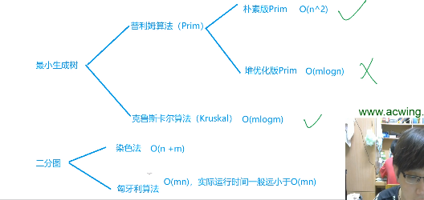
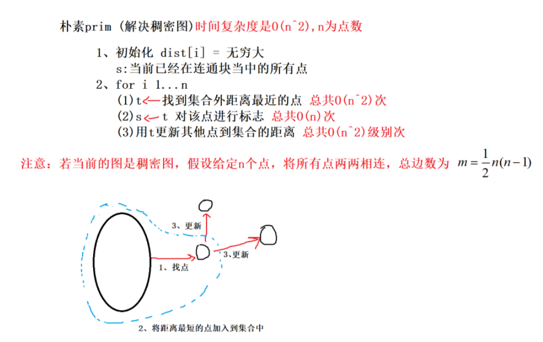
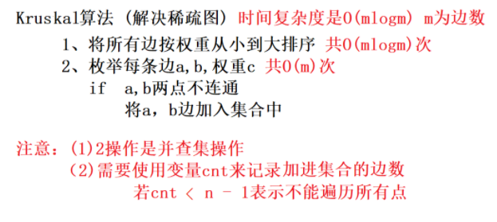

[toc]

## 最小生成树



+ 最小生成树都是**无向图**，所以add要使用两次
+ `prim` 算法适合稠密图
+ `Kruskal` 算法适合稀疏图


### 1. 朴素版prim算法

[AcWing 858. Prim算法求最小生成树](https://www.acwing.com/problem/content/860/)

+ 时间复杂度是 $O(n^2+m)$，n 表示点数，m 表示边数。
+ 采用**邻接矩阵**保存图，适用于**稠密图**
+ 最小生成树解决的是**无向图**问题，因此存储边时要添加**两条有向边**
+ **允许存在负权边、自环、重边**
  + 对于**自环**，需要先保存**最短路径长度**，再更新集合到其它点的距离，避免负权自环更新自己，出现写后读问题
  + 对于**重边**，需要初始化各个点的距离为INF，然后用**min**读入边
+ Prim算法和Dijkstra算法非常相似
  + Prim算法更新的距离是节点到生成树的距离
  + Dijkstra算法更新到源点的距离。



```cpp
int n;      // n表示点数
int g[N][N];        // 邻接矩阵，存储所有边
int dist[N];        // 存储其他点到当前最小生成树的距离
bool st[N];     // 存储每个点是否已经在生成树中


// 如果图不连通，则返回INF(值是0x3f3f3f3f), 否则返回最小生成树的树边权重之和
int prim()
{
    memset(dist, 0x3f, sizeof dist); // 初始化距离数组

    int res = 0; //最小生成树的权重之和
    
    // 循环 n 次，每次放入一个点到生成树中
    for (int i = 0; i < n; i ++ )
    {
         // 循环每一个节点，找出没有在生成树中的距离生成树最近的节点t
        int t = -1;
        for (int j = 1; j <= n; j ++ )
            if (!st[j] && (t == -1 || dist[t] > dist[j])) // a||b，只要a是真的，那就就是true，不用管b了
                t = j;

        // 如果最短的节点是 inf，表示无法形成生成树
        if (i && dist[t] == INF) return INF;

        // 权值相加，第一个节点不用增加权值
        if (i) res += dist[t];
        st[t] = true;

        // 用 t 来更新其他点到集合的距离，这是和Dijkstra算法的不同之处（Dijkstra算法是更新其他点到源点的距离）
        for (int j = 1; j <= n; j ++ ) dist[j] = min(dist[j], g[t][j]);
    }

    return res;
}

int main()
{
    memset(g, 0x3f, sizeof g);
    int m, a, b, c;
    scanf("%d%d", &n, &m);
    while (m--)
    {
        scanf("%d%d%d", &a, &b, &c);
        g[a][b] = min(g[a][b], c);
        g[b][a] = g[a][b]; // 无向图，重点
    }
    int ans = prim();
    if (ans == inf) printf("impossible\n");
    else printf("%d\n", ans);
    return 0;
}
```


### 2. `Kruskal`算法

[AcWing 859. Kruskal算法求最小生成树](https://www.acwing.com/problem/content/description/861/)

+ 时间复杂度是 `O(mlogm)`, n 表示点数，m 表示边数
+ 用于求解**稀疏图**的最小生成树
+ 每次加入不连通的权值最小的边



```cpp
int n, m;       // n是点数，m是边数
int p[N];       // 并查集的父节点数组

struct Edge     // 存储边
{
    int a, b, w;

    // 重写小于号，根据权值来排序
    bool operator< (const Edge &W)const
    {
        return w < W.w;
    }
}edges[M];

int find(int x)     // 并查集核心操作
{
    if (p[x] != x) p[x] = find(p[x]);
    return p[x];
}

int kruskal()
{
    // 排序，最后一个edges[m]排不到，左闭右开
    sort(edges, edges + m);

    // 初始化并查集
    for (int i = 1; i <= n; i ++ ) p[i] = i;

    // res表示生成树的权重，cnt表示已经放入生成树的边的数量
    int res = 0, cnt = 0;
    
    // 此时边的权重已经拍好了，遍历每一个结点
    for (int i = 0; i < m; i ++ )
    {
        int a = edges[i].a, b = edges[i].b, w = edges[i].w;

        // 找到a和b的祖宗
        a = find(a), b = find(b);
        
        // 祖宗不同，表示两个连通块不连通，则将这两个连通块合并
        if (a != b)
        {
            p[a] = b;
            res += w;
            cnt ++ ;
        }
    }

    // 边少于 n - 1，表示无法形成生成树，图不连通
    if (cnt < n - 1) return INF;
    
    return res;
}
```
