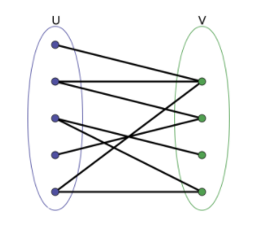
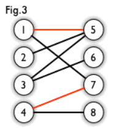
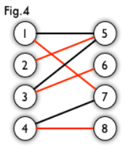
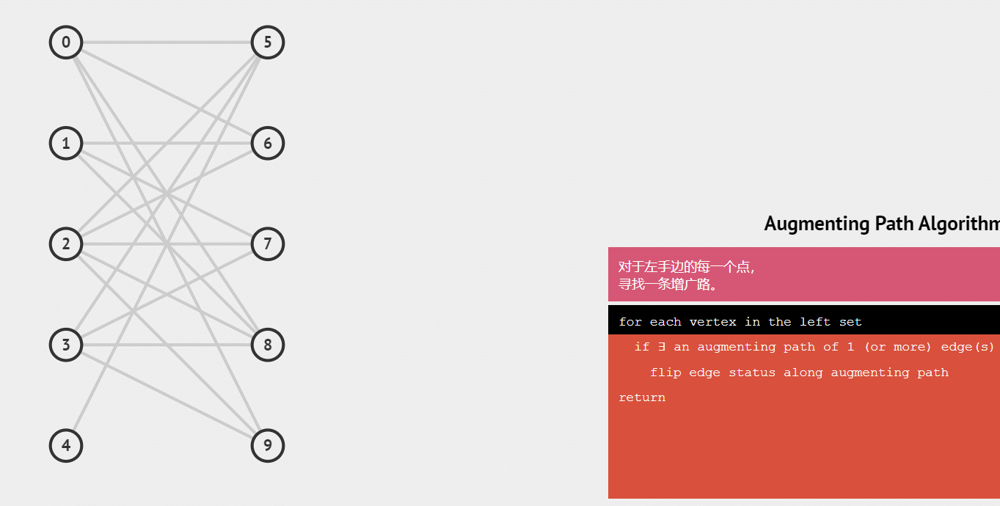

[toc]

## 二分图

**只有最小生成树和二分图是无向图需要添加两次边。**

### 1. 概念

奇数环：由奇数条边形成的一个环。

二分图：一定不含有奇数环，可能包含长度为**偶数**的环， **不一定是连通图**。简单来说，就是顶点集 V 可分割为两个互不相交的子集，且图中每条边依附的两个顶点都分属于这两个互不相交的子集，两个子集内的顶点不相邻。



匹配：在给定一个二分图 G，在 G 的一个子图 M 中，若 M 的边集中的任意两条边都不依附于同一个顶点，则称 M 是一个匹配。简单来说，匹配就是一个二分图中边的集合，其中任意两条边都没有公共顶点。如图，红边就是一个匹配。



最大匹配：给定二分图 G 中的所有匹配，所含匹配边数最多的匹配，称为这个图的最大匹配，选择最大匹配的问题即为图的**最大匹配问题**。如图，红边就是一个最大匹配。



完全匹配：一个匹配中，图中每个顶点都与图中某条边相关联，则称此匹配为完全匹配，即一个图的某个匹配中，所有的顶点都是匹配点，就是一个完全匹配。简单来说，有一边的所有点和另一边都有对应。


完美匹配：对于一个二分图，左点集与右点集的**点数相同**，若存在一个匹配，包含左点集、右点集的所有顶点，则称为完美匹配。简单来说，**完全匹配是一边对另一边的匹配，完美匹配是双方的。**


### 2. 染色法判断二分图

[AcWing 860. 染色法判定二分图](https://www.acwing.com/problem/content/862/)

+ 时间复杂度是 $O(n+m)$, n 表示点数，m 表示边数。
+ 将所有点分成两个集合，使得所有边只出现在集合之间，就是二分图。
+ 二分图是**无向图**，用邻接表存储图，注意无向图的边数为**2m**。
+ 图中不含奇数环（环的边数是奇数）

`dfs`版本：

1. 染色可以使用 1 和 2 区分不同颜色，用 0 表示未染色。
2. 遍历所有点，每次将未染色的点进行`dfs`, 默认染成 1 或者 2。
3. 由于某个点染色成功不代表整个图就是二分图，因此只有某个点染色失败才能立刻`break/return`；染色失败相当于存在相邻的 2 个点染了相同的颜色。

`bfs`版本：

1. 颜色 1 和 2 表示不同颜色, 0 表示未染色。
2. 定义 queue 是存`PII`，表示 <点编号, 颜色>。
3. 同理，遍历所有点, 将未染色的点都进行 `bfs`。
4. 队列初始化将第 i 个点入队, 默认颜色可以是 1 或 2。
   + while (队列不空)。每次获取队头 t, 并遍历队头 t 的所有邻边。
     + 若邻边的点未染色则染上与队头 t 相反的颜色，并添加到队列。
     + 若邻边的点已经染色且与队头 t 的颜色相同, 则返回false。

```cpp
int n; // n表示点数
int h[N], e[M], ne[M], idx; // 邻接表存储图
int color[N]; // 表示每个点的颜色，-1表示未染色，0表示白色，1表示黑色

// 参数：u表示当前节点，c表示当前点的颜色，dfs(u,c)表示把u号点染色成c颜色，并且判断从u号点开始染其他相连的点是否成功
bool dfs(int u, int c)
{
    color[u] = c;
    for (int i = h[u]; i != -1; i = ne[i])
    {
        int j = e[i];
        if (color[j] == -1)
        {
            if (!dfs(j, !c)) return false; // 染成相反的颜色
        }
        else if (color[j] == c) return false;
    }

    return true;
}

// 记住一个模板就够了
bool bfs(int u, int c)
{
    int q[N], tt = -1, hh = 0;
    q[++tt] = u;
    color[u] = c;

    while(tt >= hh)
    {
        int t = q[hh++];
        int c = color[t];

        for (int i = h[t]; i != -1; i = ne[i])
        {
            int j = e[i];
            if (color[j] == -1)
            {
                color[j] = !c;
                q[++tt] = j; 
            }
            else if (color[j] == c)
                return false;
        }
    }

    return true;
}

bool check()
{
    memset(color, -1, sizeof color);
    bool flag = true;
    
    // 有可能不连通，所有要遍历每一个节点
    for (int i = 1; i <= n; i ++ )
        if (color[i] == -1)
            if (!dfs(i, 0)) // 开始染色
            {
                flag = false;
                break;
            }
    return flag;
}
```


### 3. 匈牙利算法求二分图最大匹配数

[AcWing 861. 二分图的最大匹配](https://www.acwing.com/problem/content/863/)

+ 时间复杂度是 $O(nm)$, n 表示点数，m 表示边数
+ 用邻接表存储图，但不必存放双向边，**只需存储单向边**，因此最大边数为M，而不必用2M
+ 核心思想：
  + 假设a和b是左边顶点，c和d是右边顶点，a和b都能匹配c，但a还可以匹配d
  + 当a匹配c后，b没有右边顶点可匹配
  + a存在另一个可匹配顶点d，因此把a改成匹配d，这时b再匹配c
+ 模拟：男女配对，如果你想找的妹子已经有了男朋友，你就去问问她男朋友有没有备胎，如果有就把这个让给我好吧。



```cpp
int n1, n2; // n1表示第一个集合中的点数，n2表示第二个集合中的点数
int h[N], e[M], ne[M], idx; // 邻接表，匈牙利算法中只会用到从第一个集合指向第二个集合的边，所以这里只用存一个方向的边
int match[N]; // 存储第二个集合中的每个点当前匹配的第一个集合中的点是哪个。match[j]=a，表示女孩j的现有配对男友是a。
bool st[N]; // 表示第二个集合中的每个点是否已经被遍历过。st[]数组我称为临时预定数组，st[j]=true表示一轮模拟匹配中，女孩j被预定了。

//这个函数的作用是用来判断,如果加入 x 来参与模拟配对,会不会使匹配数增多
int find(int x) {
    //遍历自己喜欢的女孩
    for (int i = h[x]; i != -1; i = ne[i]) {
        int j = e[i];
        //这一轮模拟匹配中,这个女孩尚未被预定
        if (!st[j]) {
            st[j] = true;//那 x 就预定这个女孩了
            //如果女孩 j 没有男朋友，或者她原来的男朋友（match[j]）能够预定其它喜欢的女孩，配对成功,更新match
            if (!match[j] || find(match[j])) {
                match[j] = x;
                return true;
            }
        }
    }
    //自己中意的全部都被预定了，配对失败。
    return false;
}

// 求最大匹配数，依次枚举第一个集合中的每个点能否匹配第二个集合中的点
int res = 0;
for(int i = 1; i <= n1 ; i++)
{  
    //因为每次模拟匹配的预定情况都是不一样的，所以每轮模拟都要初始化，才可以横刀夺爱
    memset(st, false, sizeof st);
    if(find(i)) res++;
} 
```

