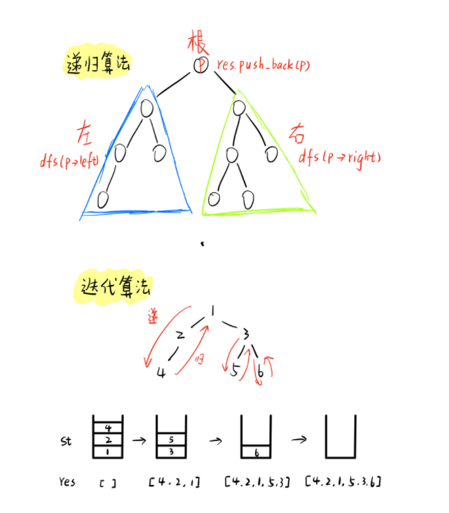

[toc]

## 二叉树

```cpp
struct TreeNode
{
    int val;
    TreeNode *left;
    TreeNode *right;
    TreeNode(int x) : val(x), left(NULL), right(NULL) {}
};
```

二叉树知识点可以分为三个部分：`AVL`，搜索二叉树，线索二叉树。

+ 一棵 N 个结点的树有 N-1 条边
+ 在非空二叉树中，第 i 层的结点总数不超过 $2^{i-1},i>=1$

+ 深度为 h 的二叉树最多有 $2^h-1,h>=1$ 个结点，最少有 h 个结点；

+ 对于任意一棵二叉树，如果其叶结点数为 $N_0$，而度数为 2 的结点总数为 $N_2$，则$N_0=N_2+1$

+ 具有 n 个结点的完全二叉树的深度为 $H=⌊log_2n⌋+1$(取下整数)
+ 非根结点（序号 i > 1）的父结点的序号是 $⌊ i / 2⌋$（向下取整）
+ 结点（序号为 i）的左孩子结点的序号是 $2i$（$2i ≤ n$，否则没有左孩子）
+ 结点（序号为 i）的右孩子结点的序号是 $2i+1$（$2i +1 ≤ n$，否则没有右孩子）

+ 给定 N 个节点，能构成h(N)种不同的二叉树。h(N)为卡特兰数的第N项。$h(n)=C(2n，n)/(n+1) = \frac{(2n)!}{n!(n+1)!}$
+ 设有 i 个枝点，I 为所有枝点的道路长度总和，J 为叶的道路长度总和，$J=l+2i$


### 1. 中序遍历

中序遍历过程的顺序是 **左 -> 根 -> 右**

#### 1.1 递归算法

先遍历左子树，再遍历当前根，然后遍历右子树。递归函数的中止条件是当前结点为空，同时当遍历当前结点时，将该点加入遍历数组即可。

```cpp
class Solution {
public:
    vector<int> res;
    vector<int> inorderTraversal(TreeNode* root) {
        dfs(root);
        return res;
    }

    void dfs(TreeNode* root)
    {
        if (!root) return;
        dfs(root -> left);
        res.push_back(root -> val);
        dfs(root -> right);
    }
};
```

#### 1.2 迭代算法

我们只需要自己模拟实现一个栈。我们需要将所有左子树链上的所有点放入栈中，该过程即为递，然后取出栈顶，加入遍历数组，之后再放入右子树，同时注意这里的右子树指的是整个右子树的左子树链。直到遍历完所有结点。

```cpp
class Solution {
public:
    vector<int> inorderTraversal(TreeNode* root) {
        vector<int> res;
        stack<TreeNode*> st;

        auto p = root;

        while (p || !st.empty())
        {
            while (p)
            {
                st.push(p);
                p = p -> left;
            }

            p = st.top();
            st.pop();
            res.push_back(p -> val);
            p = p -> right;
        }

        return res;
    }
};
```




### 2. 前序遍历

前序遍历顺序为**根 -> 左 -> 右**，所以运用递归算法时，先将该点放入遍历数组，再递归遍历左子树和右子树

#### 2.1 递归算法

```cpp
class Solution {
public:
    vector<int> res;
    vector<int> preorderTraversal(TreeNode* root) {
        dfs(root);
        return res;
    }

    void dfs(TreeNode* root)
    {
        if (!root) return;
        res.push_back(root -> val);
        dfs(root -> left);
        dfs(root -> right);
    }
};
```

#### 2.2 输出叶子节点

```cpp
void PerOrderPintLeaves(BinTree BT){
    if(BT){
        if(!BT->Left && !BT->Right)cout << BT->Data << endl;
        PerOrderPintLeaves(BT->Left);
        PerOrderPintLeaves(BT->Right);
    }
}
```

#### 2.3 二叉树的高度

[AcWing 71. 二叉树的深度](https://www.acwing.com/problem/content/67/)

```cpp
class Solution {
public:
    int treeDepth(TreeNode* root) {
        if (!root) return 0;
        int l = treeDepth(root->left);
        int r = treeDepth(root->right);
        return l > r ? l + 1 : r + 1;
    }
};
```

#### 2.4 迭代算法

当前遍历结点即为根，所以在迭代算法中，先将该点放入遍历数组，然后将左子树链递到最低层，然后出栈，放入右子树。

```cpp
class Solution {
public:
    vector<int> preorderTraversal(TreeNode* root) {
        vector<int> res;
        stack<TreeNode*> st;
        auto p = root;

        while (p || !st.empty())
        {
            while (p)
            {
                res.push_back(p -> val);
                st.push(p);
                p = p -> left;
            }

            p = st.top();
            st.pop();
            p = p-> right;
        }

        return res;
    }
};
```


### 3. 后序遍历

后序遍历的顺序为**左 -> 右 -> 根**

#### 3.1 递归算法

```cpp
class Solution {
public:
    vector<int> res;
    vector<int> postorderTraversal(TreeNode* root) {
        dfs(root);
        return res;
    }

    void dfs(TreeNode* root)
    {
        if (!root) return;
        dfs(root -> left);
        dfs(root -> right);
        res.push_back(root -> val);
    }
};
```

#### 3.2 迭代算法

```cpp
class Solution {
public:
    vector<int> postorderTraversal(TreeNode* root) {
        vector<int> res;
        stack<TreeNode*> st;

        auto p = root;
        while (p || !st.empty())
        {
            while (p)
            {
                res.push_back(p -> val);
                st.push(p);
                p = p -> right;
            }

            p = st.top();
            st.pop();
            p = p -> left;
        }
        reverse(res.begin(), res.end());
        return res;
    }
};
```


### 4. 层次遍历

[AcWing 43. 不分行从上往下打印二叉树](https://www.acwing.com/problem/content/41/)

[AcWing 44. 分行从上往下打印二叉树](https://www.acwing.com/problem/content/42/)

[AcWing 45. 之字形打印二叉树](https://www.acwing.com/problem/content/43/)

层序遍历，顾名思义需要对二叉树进行一层一层的遍历。因此可以采用 BFS 的思路，根据 BFS 的性质，每进行一次扩展，会将下一层的点全部放入队列中，所以每次在对队列进行取出操作时，当前队列中的所有元素均当前层元素。因为我们需要一边取出元素，一边放入元素。所以在每一次更迭前，先记录当前的队列的大小，即为当前层的元素，然后取出队头的该几个元素，放入当前层遍历数组level中，同时对左右儿子进行扩展。每遍历完一层，最后将level数组插入最终遍历数组中。

```cpp
class Solution {
public:
    vector<int> printFromTopToBottom(TreeNode* root) {
        vector<int> res;
        if (!root) return res;
        queue<TreeNode*> q;
        q.push(root);
        
        while (q.size())
        {
            TreeNode* t = q.front();
            q.pop();
            res.push_back(t->val);
            if (t->left) q.push(t->left);
            if (t->right) q.push(t->right);
        }
        
        return res;
    }
};
```


### 5. 重建二叉树

[AcWing 1497. 树的遍历](https://www.acwing.com/problem/content/description/1499/)

[AcWing 18. 重建二叉树](https://www.acwing.com/problem/content/23/)

**前提**：**有一种序列必须是中序！**

1. 根据先序（或后序）遍历序列第一个（或最后一个）结点**确定根结点**
2. 根据根结点在中序序列中**分割出左右**两个子序列
3. 对左子树和右子树分别递归使用同样的方法继续分解

```cpp
// 模板一：使用结构体建树，这里是使用前序和中序进行建树
struct TreeNode
{
    int val;
    TreeNode *left;
    TreeNode *right;
    TreeNode(int x) : val(x), left(NULL), right(NULL) {}
};

class Solution
{
public:
    unordered_map<int, int> pos; // 寻找根节点

    TreeNode *buildTree(vector<int> &preorder, vector<int> &inorder)
    {
        int len = inorder.size();
        for (int i = 0; i < len; i++)
            pos[inorder[i]] = i;
        if (len == 0) return NULL; // 这个不能忘记
        else return dfs(preorder, inorder, 0, len - 1, 0, len - 1);
    }

    TreeNode *dfs(vector<int> &pre, vector<int> &in, int pl, int pr, int il, int ir)
    {
        TreeNode *root = new TreeNode(pre[pl]); // 这个格式不能忘记
        int k = pos[root->val];
        if (k > il) root->left = dfs(pre, in, pl + 1, k - il + pl, il, k - 1); // 核心
        if (k < ir) root->right = dfs(pre, in, k - il + pl + 1, pr, k + 1, ir); // 核心
        return root;
    }
};
```

```cpp
// 模板二：使用哈希表建树，这里是使用中序和后序进行建树
int n, inorder[N], postorder[N];
unordered_map<int, int> l, r, pos;

// 这个建树是核心，参数：中序遍历的左右位置，后序遍历的左右位置
int build(int il, int ir, int pl, int pr)
{
    int root = postorder[pr]; // 寻找根节点
    int k = pos[root]; // 找到根节点的位置
    if (il < k) l[root] = build(il, k - 1, pl, k - 1 - il + pl); // 核心， 1.判断有无左子树il < k；2.位置的计算
    if (ir > k) r[root] = build(k + 1, ir, k - il + pl, pr - 1); // 核心， 1.判断有无右子树ir > k；2.位置的计算
    return root;
}

int main()
{
    scanf("%d", &n);
    for (int i = 0; i < n; i++) scanf("%d", &postorder[i]);
    for (int i = 0; i < n; i++)
    {
        scanf("%d", &inorder[i]);
        pos[inorder[i]] = i; // 保存到哈希表中，用于查找g
    }
    int root = build(0, n - 1, 0, n - 1);

    return 0;
}
```


### 6. 公共祖先

```cpp
void bfs(int root)  // 预处理倍增数组
{
    memset(depth, 0x3f, sizeof depth);
    depth[0] = 0, depth[root] = 1;  // depth存储节点所在层数
    int hh = 0, tt = 0;
    q[0] = root;
    while (hh <= tt)
    {
        int t = q[hh ++ ];
        for (int i = h[t]; ~i; i = ne[i])
        {
            int j = e[i];
            if (depth[j] > depth[t] + 1)
            {
                depth[j] = depth[t] + 1;
                q[ ++ tt] = j;
                fa[j][0] = t;  // j的第二次幂个父节点
                for (int k = 1; k <= 15; k ++ )
                    fa[j][k] = fa[fa[j][k - 1]][k - 1];
            }
        }
    }
}

int lca(int a, int b)  // 返回a和b的最近公共祖先
{
    // 我们默认节点a要更深一点
    if (depth[a] < depth[b]) swap(a, b);
    for (int k = 15; k >= 0; k -- )
        if (depth[fa[a][k]] >= depth[b])
            a = fa[a][k];
    if (a == b) return a;
    for (int k = 15; k >= 0; k -- )
        if (fa[a][k] != fa[b][k])
        {
            a = fa[a][k];
            b = fa[b][k];
        }
    return fa[a][0];
}
```


### 7. 二叉搜索树

就是一个二分法的运用！


### 8. `AVL` 树

[AcWing 72. 平衡二叉树](https://www.acwing.com/problem/content/68/)

左右子树的高度差不超过1，可以借用上一题的思想。

```cpp
class Solution {
public:
    bool flag = true;    
    
    bool isBalanced(TreeNode* root) {
        treeDepth(root);
        return flag;
    }
     // 返回二叉树的高度，中途进行一个判读
    int treeDepth(TreeNode* root) {
        if (!root) return 0;
        int l = treeDepth(root->left);
        int r = treeDepth(root->right);
        if (abs(l - r) > 1) flag = false;
        return l > r ? l + 1 : r + 1;
    }
};
```


### 9. 中序遍历的下一个节点

[AcWing 19. 二叉树的下一个节点](https://www.acwing.com/problem/content/31/)

只需要考虑这个结点是否有右子树：

+ 结点有右子树，那么下一个结点就是其右子树的最左结点
+ 结点没有右子树，但是结点是其父结点的左结点，那么其下一个结点就是其父结点
+ 结点没有右子树，又是父结点的右结点，那么就向上遍历，找到一个是父结点左儿子的结点，如果存在，则这个
  父结点为所求结点

```cpp
struct TreeNode
{
    int val;
    TreeNode *left;
    TreeNode *right;
    TreeNode *father; // 这里多了一个father节点
    TreeNode(int x) : val(x), left(NULL), right(NULL), father(NULL) {}
};

class Solution
{
public:
    TreeNode *inorderSuccessor(TreeNode *p)
    {
        // 存在右儿子的情况
        if (p->right)
        {
            p = p->right;
            while (p->left) p = p->left; // 一直找右儿子的最左的儿子
            return p;
        }

        while (p->father && p == p->father->right) p = p->father; // 一直往左上的方向跑

        return p->father; // 没有右儿子，下一个节点就是自己的父亲
    }
};
```


### 10. 二叉树的镜像

[AcWing 38. 二叉树的镜像](https://www.acwing.com/problem/content/description/37/)

```
原树：
      8
     / \
    6  10
   / \ / \
  5  7 9 11

镜像后的树：
      8
     / \
    10  6
   / \ / \
  11 9 7  5
```

我们可以发现镜像后的树就是将**原树的所有节点**的左右儿子互换！

所以我们递归遍历原树的所有节点，将每个节点的左右儿子互换即可。

```cpp
class Solution
{
public:
    void mirror(TreeNode *root)
    {
        if (!root) return;
        swap(root->right, root->left); // 交换两个节点，全部交换
        mirror(root->right);
        mirror(root->left);
    }
};
```


### 11. 对称二叉树

[AcWing 39. 对称的二叉树](https://www.acwing.com/problem/content/description/38/)

[AcWing 476. 对称二叉树](https://www.acwing.com/problem/content/478/)

递归判断两个子树是否互为镜像。

两个子树互为镜像当且仅当：

+ 两个子树的根节点值相等；
+ 第一棵子树的左子树和第二棵子树的右子树互为镜像，且第一棵子树的右子树和第二棵子树的左子树互为镜像

从上到下每个节点仅被遍历一遍，所以时间复杂度是 O(n)。

```
如下图所示二叉树[1,2,2,3,4,4,3,null,null,null,null,null,null,null,null]为对称二叉树：
    1
   / \
  2   2
 / \ / \
3  4 4  3

如下图所示二叉树[1,2,2,null,4,4,3,null,null,null,null,null,null]不是对称二叉树：
    1
   / \
  2   2
   \ / \
   4 4  3
```

```cpp
class Solution
{
public:
    bool isSymmetric(TreeNode *root)
    {
        if (!root) return true;
        return dfs(root->left, root->right);
    }

    bool dfs(TreeNode *l, TreeNode *r)
    {
        if (!l || !r) return !l && !r; // 只有全部都是空的时候才会返回true
        if (l->val != r->val) return false; // 两个更节点必须相同
        return dfs(l->left, r->right) && dfs(l->right, r->left); // 核心，第一棵子树的左子树和第二棵子树的右子树互为镜像，且第一棵子树的右子树和第二棵子树的左子树互为镜像
    }
};
```


### 12. 二叉树中和为某一值的路径

[AcWing 47. 二叉树中和为某一值的路径](https://www.acwing.com/problem/content/45/)

```cpp
class Solution {
public:
    vector<vector<int> > ans;
    vector<int> path;

    vector<vector<int>> findPath(TreeNode* root, int sum) {
        dfs(root, sum);
        return ans;
    }
    
    void dfs(TreeNode* root, int sum)
    {
        if (!root) return;
        sum -= root->val;
        path.push_back(root->val); // 将节点放入路径
        if (!root->left && !root->right && !sum) ans.push_back(path);
        dfs(root->left, sum);
        dfs(root->right, sum);
        path.pop_back(); // 取出来，这个容易忘记
    }
};
```


### 13. 二叉树的每个子树的大小

[AcWing 476. 对称二叉树](https://www.acwing.com/problem/content/478/)

```cpp
int sum[N];

// 获取一某个节点为根节点的子树的大小
int getSize(int u)
{
    if (!u) return 0; // 节点为空，按题目的输入，有的时候空节点用-1表示
    if (sum[u]) return sum[u];
    sum[u] = 1 + getSize(l[u]) + getSize(r[u]);
    return sum[u];
}

int main()
{
    ...
    getSize(1);
    ...
    return 0;
}
```


### 14. 完全二叉树

[AcWing 1240. 完全二叉树的权值](https://www.acwing.com/problem/content/1242/)

[AcWing 1256. 扩展二叉树](https://www.acwing.com/problem/content/1258/)

完全二叉树每层的开头为 $2^{n-1}$ 结尾则是 $2^n - 1$。

```cpp
int deep = 1; // 表示深度

for (int i = 1; i <= n; i *= 2) // 这里的 i 表示每一层的第一个节点 2^(n - 1)
{
    
    for (int j = i; j <= i * 2 - 1 && j <= n; j++) // 每一层的最后一个节点是2^n - 1，刚好是i * 2 - 1
    {
       // TODO
    }
   
    deep++;
}
```

