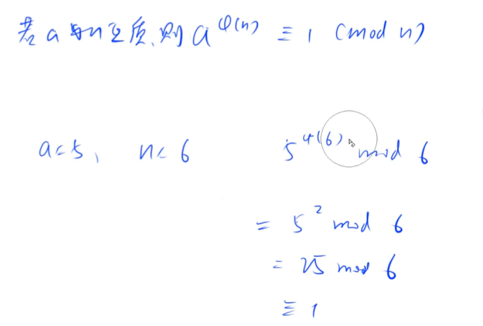
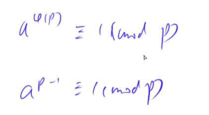

[toc]

## 欧拉函数

+ 互质：两个数只有公因数1

+ 1 ~ N 中与 N 互质的数的个数被称为欧拉函数，记为$ϕ(N)$。
+ 若在算数基本定理中，$N=p_1^{a_1}*p_2^{a_2}*...*p_m^{a_m}$，则：$ϕ(N) = N∗\frac{p_1−1}{p_1}∗\frac{p_2−1}{p_2}∗…∗\frac{p_m−1}{p_m}$，推导原理是容斥原理

[AcWing 201. 可见的点](https://www.acwing.com/problem/content/203/)

[AcWing 220. 最大公约数](https://www.acwing.com/problem/content/222/)

### 1. 求欧拉函数

[AcWing 873. 欧拉函数](https://www.acwing.com/problem/content/875)

使用试除法求质数，再套公式。

```cpp
int phi(int x)
{
    int res = x;
    for (int i = 2; i <= x / i; i ++ )
        if (x % i == 0)
        {
            res = res / i * (i - 1); // 这个就是欧拉函数的计算公式
            while (x % i == 0) x /= i;
        }
    if (x > 1) res = res / x * (x - 1); // 不要忘记最后一个质因数

    return res;
}
```


### 2. 筛法求欧拉函数 

[AcWing 874. 筛法求欧拉函数](https://www.acwing.com/problem/content/description/876/)

给定一个正整数n，求1~n中每个数的欧拉函数之和。

+ 欧拉函数是一个积性函数：$φ(mn)=φ(m)∗φ(n)$
+ 如果 $x$ 是一个素数 $p$：$x=p$  , $φ(x)=x∗(1−\frac1p)=p∗(p−\frac1p)=p−1$
+ 不是素数的时候，用最小的素因子去计算：$i\%p=0$，$gcd(i,p)=p$，$φ(i)=i∗(1−\frac{1}{p_1})∗…∗(1−\frac{1}{p_k})$，因为$p$是$i$的因子，所以在计算 $φ(i)$ 的已经算过 $p$ 了：$ φ(i∗p)=p∗i∗(1−\frac{1}{p_1})∗…∗(1−\frac{1}{p_k})=p∗φ(i)$
+ 当 i 和 p 互质的时候：$i\%p!=0$ ，  $gcd(i,p)=1$，$φ(i∗p)=φ(i)∗φ(p)=φ(i)∗(p−1)$    
+ 综上所述：$φ(i∗p)=\left\{\begin{aligned} p∗φ(i) && i\%p=0 \\ φ(i)∗(p−1)  && i\%p!=0 \end{aligned} \right.$
+ **核心：筛质数 + 使用最小质因子计算欧拉函数**

```cpp
int primes[N], cnt; 
int euler[N];        
bool st[N];         // st[x]存储x是否被筛掉，质数

void get_eulers(int n)
{
    // n = 1 的时候欧拉函数为1
    euler[1] = 1;
    for (int i = 2; i <= n; i ++ ) // 易错
    {
        if (!st[i])
        {
            primes[cnt ++ ] = i; // 添加筛选出来的质数
            euler[i] = i - 1; // 质数的欧拉函数
        }
        for (int j = 0; primes[j] <= n / i; j ++ )
        {
            int t = primes[j] * i;
            st[t] = true;
            if (i % primes[j] == 0) // 不是最小质因子，就要退出循环了
            {
                euler[t] = euler[i] * primes[j]; // φ(i∗p) = p ∗ φ(i)
                break;
            }
            euler[t] = euler[i] * (primes[j] - 1); // i和p互质，φ(i∗p)=φ(i)∗(p−1)
        }
    }
}
```


### 3. 欧拉定理





