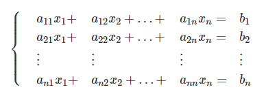
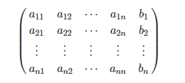
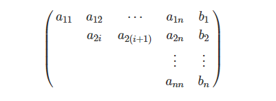

[toc]

## 高斯消元

[AcWing 883. 高斯消元解线性方程组](https://www.acwing.com/problem/content/description/885/)

+ $O(n^3)$
+ 通过初等行变换把增广矩阵化为阶梯型矩阵并回代得到方程的解。
+ 适用于求解**包含 n 个方程，n 个未知数**的多元线性方程组。

### 1. 模板

```c++
const double eps = 1e-6;

// a[N][N]是增广矩阵
int gauss()
{
    int c, r; // 列，行
    for (c = 0, r = 0; c < n; c ++ )
    {
        int t = r;
        for (int i = r; i < n; i ++ )   // 找到绝对值最大的行
            if (fabs(a[i][c]) > fabs(a[t][c]))
                t = i;

        if (fabs(a[t][c]) < eps) continue; // 当前列全部都是 0

        for (int i = c; i <= n; i ++ ) swap(a[t][i], a[r][i]);      // 将绝对值最大的行换到最顶端   
        for (int i = n; i >= c; i -- ) a[r][i] /= a[r][c];      // 将当前上的首位变成1
        for (int i = r + 1; i < n; i ++ )       // 用当前行将下面所有的列消成0
            if (fabs(a[i][c]) > eps)
                for (int j = n; j >= c; j -- )
                    a[i][j] -= a[r][j] * a[i][c];

        r ++ ;
    }

    if (r < n) // 秩小于n
    {
        for (int i = r; i < n; i ++ )
            if (fabs(a[i][n]) > eps) // 出现了 b！= 0
                return 2; // 无解
        return 1; // 有无穷解
    }

    for (int i = n - 1; i >= 0; i -- )
        for (int j = i + 1; j < n; j ++ )
            a[i][n] -= a[i][j] * a[j][n];

    return 0; // 有唯一解
}
```


### 2. 前置知识

+ 初等行（列）变换
  + 把某一行乘一个非0的数 (方程的两边同时乘上一个非0数不改变方程的解)
  + 交换某两行 (交换两个方程的位置)
  + 把某行的若干倍加到另一行上去 （把一个方程的若干倍加到另一个方程上去）
+ 方程组



+ 增广矩阵



+ 阶梯型矩阵



### 3. 算法步骤

+ 枚举每一列c

+ 找到当前列绝对值最大的一行
+ 用初等行变换(2) 把这一行换到最上面（未确定阶梯型的行，并不是第一行）
+ 用初等行变换(1) 将该行的第一个数变成 1 （其余所有的数字依次跟着变化）
+ 用初等行变换(3) 将下面所有行的当前列的值变成 0


