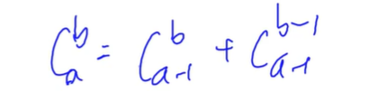
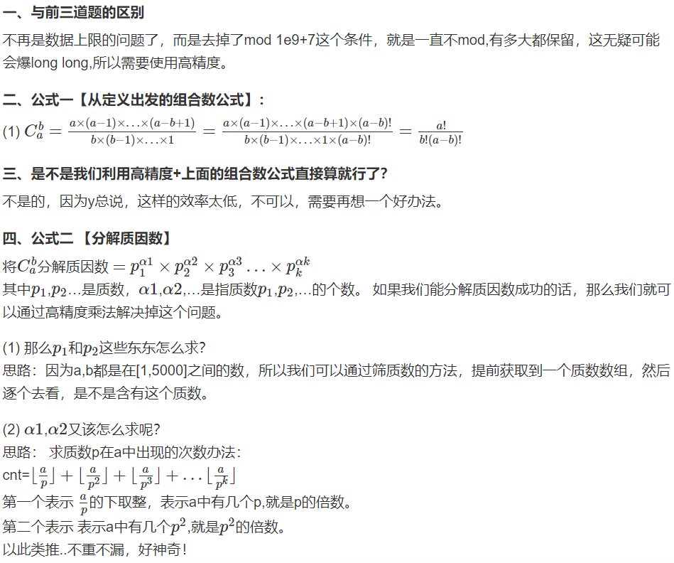

[toc]

## 组合数

+ 从a个数中取b个数，看有多少种取法

$C_a^b=\frac{a!}{b! (a-b)!}=a! \ast b!^{-1} \ast (a-b)!^{-1}$


### 1. 递归法求组合数

[AcWing 885. 求组合数 I](https://www.acwing.com/problem/content/887)

**范围：a的大小不能超过1000，结果需要取模**



```c++
// c[a][b] 表示从a个苹果中选b个的方案数
for (int i = 0; i < N; i ++ )
    for (int j = 0; j <= i; j ++ )
        if (!j) c[i][j] = 1;
        else c[i][j] = (c[i - 1][j] + c[i - 1][j - 1]) % mod;
```


### 2. 通过预处理逆元的方式求组合数

[AcWing 886. 求组合数 II](https://www.acwing.com/problem/content/888/)

**范围：a的大小不能超过100000，结果需要取模**

$C_a^b=\frac{a!}{b! (a-b)!}=a! \ast b!^{-1} \ast (a-b)!^{-1}$

$b^{-1}与(a-b)^{-1}如何求?$

$b!^{-1}=((b-1)!b)^{-1}=(b-1)!^{-1} \ast b^{-1} - ①$

$b^{-1}=b^{1e9+5}(根据费马小定理) - ②$

$由①②得b!^{-1}=(b-1)!^{-1} \ast b^{1e9+5}=(b-1)!^{-1} \ast b^{mod-2}$

`mod=1e9+7` 是质数，所以 `2-(1e9+6)` 与 `1e9+7` 互质，所以可以使用费马小定理来求解逆元，逆元通过快速幂求解。

```c++
const int N = 1e5 + 5, mod = 1e9 + 7;
typedef long long ll;
ll fact[N], infact[N];

// 快速幂
long long qmi(int m, int k, int p)
{
    long long res = 1, t = m;
    while (k)
    {
        if (k & 1) res = res * t % p; 
        t = t * t % p;
        k >>= 1; 
    }
    return res;
}


fact[0] = infact[0] = 1; // 阶乘不能有0

// 预处理阶乘的余数和阶乘逆元的余数
for (int i = 1; i < N; i ++ )
{
    fact[i] = (LL)fact[i - 1] * i % mod; // 进行阶乘
    infact[i] = (LL)infact[i - 1] * qmi(i, mod - 2, mod) % mod;
}

int main()
{
    ......
    printf("%lld", fact[a] * infact[a - b] % mod * infact[b] % mod);
    return 0;
}
```


### 3. Lucas定理

[AcWing 887. 求组合数 III](https://www.acwing.com/problem/content/889/)

**范围：a的大小不能超过 $10^{18}$，结果需要取模**

原理：若p是质数，则对于任意整数 `1 <= m <= n`，有：`C(n, m) = C(n % p, m % p) * C(n / p, m / p) (mod p)`

$$
C_n^m \quad = \quad C_{n \% p}^{m \% p} \quad *  \quad C_{n / p}^{m / p} \quad (mod \quad p)
$$

```cpp
typedef long long ll;
ll p;

// 快速幂
long long qmi(int m, int k)
{
    long long res = 1, t = m;
    while (k)
    {
        if (k & 1) res = res * t % p; 
        t = t * t % p;
        k >>= 1; 
    }
    return res;
}

// 按照公式求组合数
long long C(int a, int b)    
{
    long long res = 1;
    // C(a, b) = a!/(b!(a-b)!) = (a-b+1)*...*a / b! 
    // 分子有b项
    for (int i = 1, j = a; i <= b; i ++, j -- )
    {
        res = res * j % p;
        res = res * qmi(i, p - 2) % p;
    }
    return res;
}

// lucas定理
long long lucas(long long a, long long b)
{
    if (a < p && b < p) return C(a, b);
    return C(a % p, b % p) * lucas(a / p, b / p) % p;
}

int main()
{
    int n;
    scanf("%d", &n);
    while (n--)
    {
        ll a, b;
        scanf("%lld%lld%lld", &a, &b, &p);
        printf("%lld\n", lucas(a, b));
    }
    return 0;
}
```


### 4. 分解质因数法求组合数

[AcWing 888. 求组合数 IV](https://www.acwing.com/problem/content/890/)

**范围：求组合数真实值，不能取模，算出来的数字很大，需要使用高精度**



当我们需要求出组合数的真实值，而非对某个数的余数时，分解质因数的方式比较好用：

  1. 筛法求出范围内的所有质数
  2. 通过 `C(a, b) = a!/b!/(a-b)! `这个公式求出每个质因子的次数。 
  3. 规定 n! 中 p 的次数是 n / p + n / p^2 + n / p^3 + ...
  4. 用高精度乘法将所有质因子相乘

```cpp
int primes[N], cnt;     // 存储所有质数
int sum[N];     // 存储每个质数的次数
bool st[N];     // 存储每个数是否已被筛掉

// 线性筛法求素数
void get_primes(int n)      
{
    for (int i = 2; i <= n; i ++ )
    {
        if (!st[i]) primes[cnt ++ ] = i;
        for (int j = 0; primes[j] <= n / i; j ++ )
        {
            st[primes[j] * i] = true;
            if (i % primes[j] == 0) break;
        }
    }
}

// 求 n！中的次数，是指n / p + n / p^2 + n / p^3 + ...
int get(int n, int p)       
{
    int res = 0;
    while (n)
    {
        res += n / p;
        n /= p;
    }
    return res;
}

// 高精度乘低精度
vector<int> mul(vector<int> a, int b)       
{
    vector<int> c;
    int t = 0;
    for (int i = 0; i < a.size(); i ++ )
    {
        t += a[i] * b;
        c.push_back(t % 10);
        t /= 10;
    }
    while (t)
    {
        c.push_back(t % 10);
        t /= 10;
    }
    // 不用处理前导零，这道题目不会出现前导0
    return c;
}

// 预处理范围内的所有质数
get_primes(a);  

// 求每个质因数的次数
for (int i = 0; i < cnt; i ++ )     
{
    int p = primes[i];
    sum[i] = get(a, p) - get(b, p) - get(a - b, p);
}

vector<int> res;
res.push_back(1);

// 用高精度乘法将所有质因子相乘
for (int i = 0; i < cnt; i ++ )     
    for (int j = 0; j < sum[i]; j ++ )
        res = mul(res, primes[i]);
```

