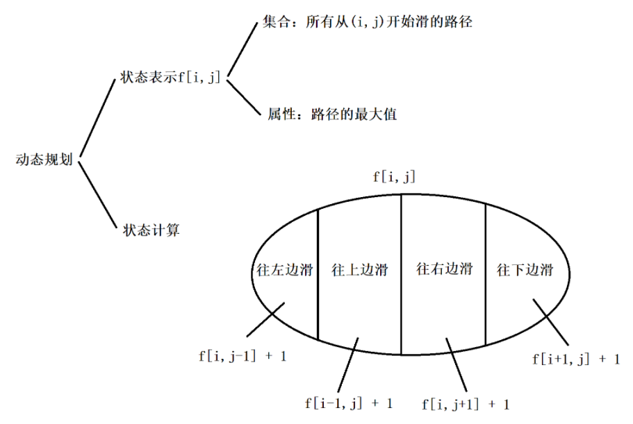

## 记忆化搜索

[AcWing 901. 滑雪](https://www.acwing.com/problem/content/903/)

### 1. 状态表示：

集合：所有从(i, j)这个点开始滑的路径长度
属性：max

### 2. 状态计算：

就是搜索，每个点能不能向上下左右动

下面代码中的  $f[x][y] = max(f[x][y], dp(a, b)+1)$ 实际上就是向四个方向判断之后转移。

### 3. 记忆化搜索

记忆化搜索，即搜索 + 动态规划数组记录上一层计算结果，避免过多的重复计算。

算法上依然是搜索的流程，但是搜索到的一些解用动态规划的那种思想和模式作一些保存。

一般说来，动态规划总要遍历所有的状态，而搜索可以排除一些无效状态。

更重要的是搜索还可以剪枝，可能剪去大量不必要的状态，因此在空间开销上往往比动态规划要低很多。

记忆化算法在求解的时候还是按着自顶向下的顺序，但是每求解一个状态，就将它的解保存下来，以后再次遇到这个状态的时候，就不必重新求解了。

这种方法综合了搜索和动态规划两方面的优点，因而还是很有实用价值的。

可以归纳为：记忆化搜索 = 搜索的形式 + 动态规划的思想

### 4. 滑雪

本来是一个 `dfs` 的过程，遍历所有的位置，找到从当前位置往下走的最大路径，再取最大值，可是这样做会有很多重复的位置被重新计算过，因此可以利用空间换时间的思想，把遍历过的位置往下走的路径的最大值进行记录，这就是记忆化搜索。

注意：f\[][]二维数组初始化的时候最好统一赋值为-1，如果不进行初始化直接用 0 判断，此题可以，可是如果遇到一些记忆化搜索的问题要求方案数的时候，初始化是 0 可能会导致个别情况计算出来的恰好结果是 0 时，却被认为未遍历过，因此统一赋值为 -1就没错了。