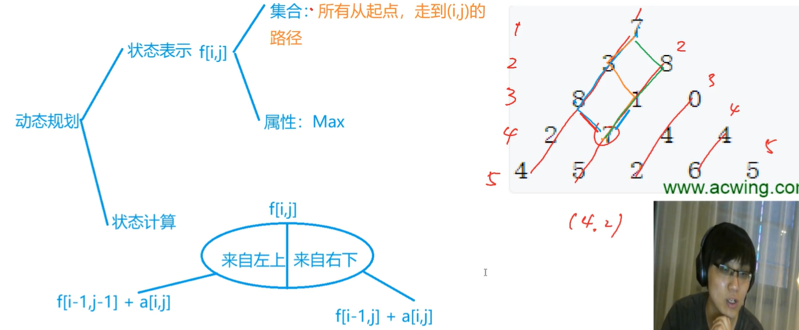
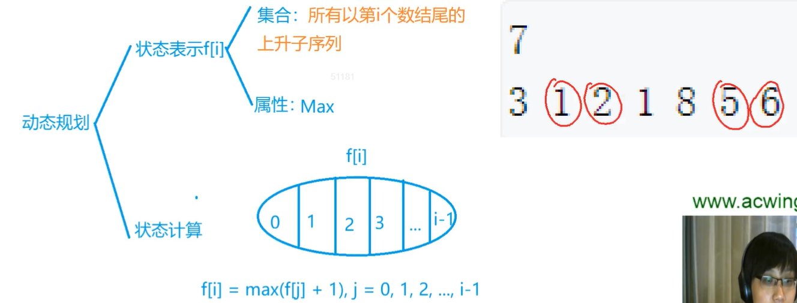
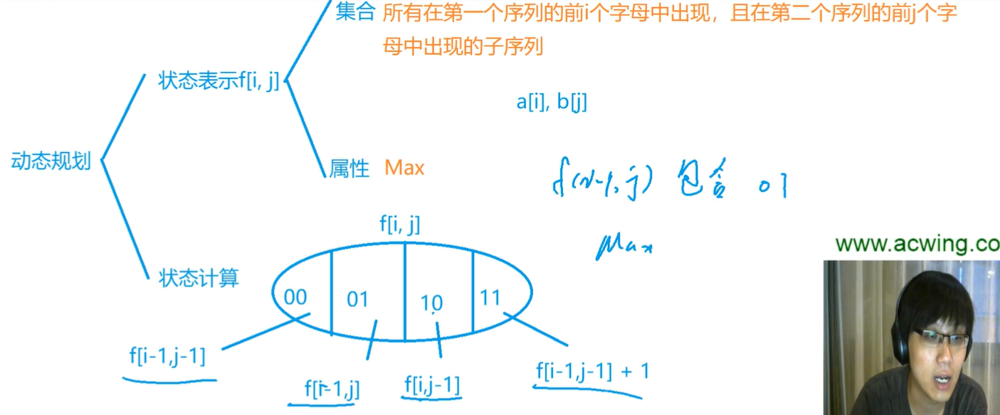
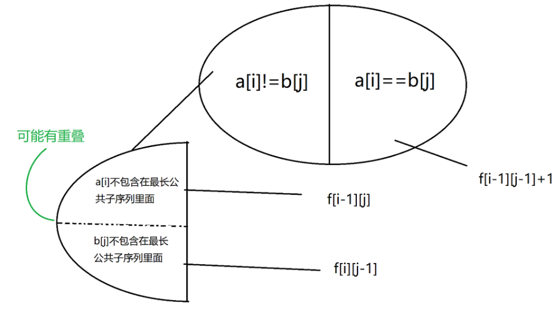
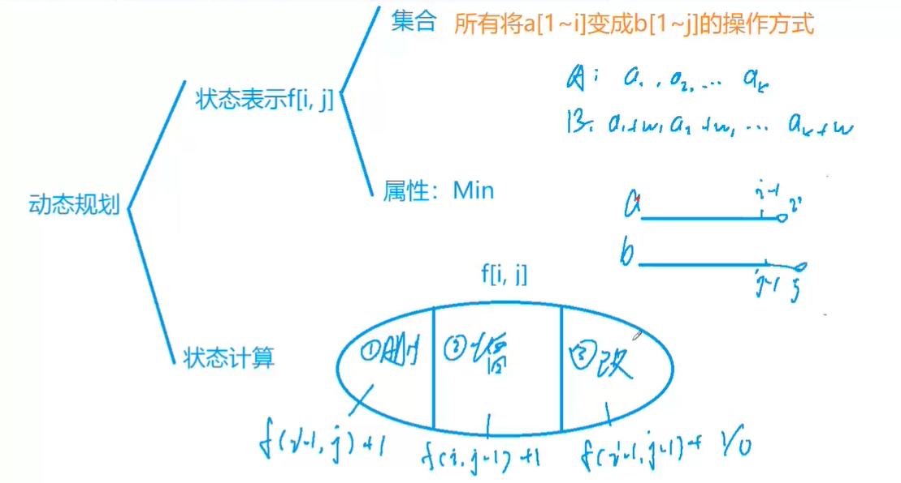

## 线性DP

### 1. 数字三角形

[AcWing 898. 数字三角形](https://www.acwing.com/problem/content/900/)

#### 方法一：从上往下



+ 状态方程：`f[i,j] = max{ f[i-1,j-1]+a[i,j], f[i-1,j]+a[i,j] }`

```java
public static void main(String[] args) throws IOException {
    BufferedReader reader = new BufferedReader(new InputStreamReader(System.in));
    String[] strings;
    int n = Integer.parseInt(reader.readLine());
    for (int i = 1; i <= n; i++) {
        strings = reader.readLine().split(" ");
        for (int j = 1; j <= i; j++) {
            a[i][j] = Integer.parseInt(strings[j - 1]);
        }
    }
    // 计算的时候，数组的值默认赋值是0，如果给出的数据是负数，就会得出错误答案，所以需要重新给数组赋值
    for (int i = 0; i <= n; i++) {
        Arrays.fill(f[i], -0x3f3f3f3f);
    }
    
    // 第一个答案就是本身
    f[1][1] = a[1][1]; 
    
    for (int i = 2; i <= n; i++) {
        for (int j = 1; j <= i; j++) {
            f[i][j] = Math.max(f[i - 1][j - 1], f[i - 1][j]) + a[i][j];
        }
    }
    
    // 在最后一行找答案
    int ans = -0x3f3f3f3f;
    for (int i = 1; i <= n; i++) {
        ans = Math.max(ans, f[n][i]);
    }
    System.out.println(ans);
}

```

#### 方法二：从下往上

不用考虑边界问题

```c++
int main()
{
    scanf("%d", &n);
    for (int i = 1; i <= n; i++)
        for (int j = 1; j <= i; j++)
            scanf("%d", &w[i][j]);

    for (int i = n; i >= 1; i--)
        for (int j = i; j >= 1; j--)
            f[i][j] = max(f[i + 1][j], f[i + 1][j + 1]) + w[i][j];
    
    printf("%d", f[1][1]);
    
    return 0;
}
```

### 2. 最长上升子序列

[AcWing 895. 最长上升子序列](https://www.acwing.com/problem/content/897/)

[AcWing 896. 最长上升子序列 II](https://www.acwing.com/problem/content/898/)

#### 动态规划的方法（n=1000）：



+ 状态方程：`f[i] = max{ f[j] + 1 }, j = 0, 1, 2, ..., i-1`

```java
int main()
{
    scanf("%d", &n);
    for (int i = 1; i <= n; i++) scanf("%d", &a[i]);

    for (int i = 1; i <= n; i++)
    {
        f[i] = 1; // 只有本身 a[i]
        for (int j = 1; j < i; j++)
            if (a[i] > a[j]) f[i] = max(f[i], f[j] + 1);
    }

    int res = 0;
    for (int i = 1; i <= n; i++) res = max(res, f[i]);
    printf("%d", res);
    
    return 0;
}
```

#### 单调数组 + 二分（n=100000）：

```c++
int find(int x)
{
    int l = 0, r = cnt;
    while (l < r)
    {
        int mid = l + r >> 1;
        if (q[mid] >= x) r = mid;
        else l = mid + 1;
    }
    return l;
}

int main()
{
    scanf("%d", &n);
    for (int i = 0; i < n; i++) scanf("%d", &a[i]);

    q[cnt] = a[0];  
    for (int i = 1; i < n; i++)
    {
        if (a[i] > q[cnt]) q[++cnt] = a[i]; // 第一种情况直接加入
        else
        {
            int pos = find(a[i]);
            q[pos] = a[i];
        }
    }

    printf("%d", cnt + 1);

    return 0;
}
```

### 3. 最长公共子序列

[AcWing 897. 最长公共子序列](https://www.acwing.com/problem/content/899/)

+ 讲解：
  + 一般第一类不写，因为会重复



+ 其他想法：



+ 状态方程：
  + 如果`a[i]!=b[j]`，`f[i][j]=max{f[i-1][j],f[i][j-1]}`
  + 如果`a[i]==b[j]`，`f[i][j]=max{f[i-1][j],f[i][j-1],f[i-1][j-1]+1}`

```c++
int main()
{
    scanf("%d%d%s%s", &n, &m, a + 1, b + 1);

    for (int i = 1; i <= n; i++)
        for (int j = 1; j <= m; j++)
        {
            f[i][j] = max(f[i - 1][j], f[i][j - 1]);
            if (a[i] == b[j]) f[i][j] = max(f[i][j], f[i - 1][j - 1] + 1);
        }

    printf("%d", f[n][m]);
    return 0;
}
```

### 4. 最短编辑距离

[AcWing 902. 最短编辑距离](https://www.acwing.com/problem/content/904/)

[AcWing 899. 编辑距离](https://www.acwing.com/problem/content/901/)



```c++
int main()
{
    scanf("%d%s%d%s", &n, a + 1, &m, b + 1);

    for (int i = 0; i <= n; i++) f[i][0] = i; // 删除 i 次
    for (int i = 0; i <= m; i++) f[0][i] = i; // 添加 i c
  
    for (int i = 1; i <= n; i++)
        for (int j = 1; j <= m; j++)
        {
            f[i][j] = min(f[i - 1][j] + 1, f[i][j - 1] + 1);
            if (a[i] == b[j]) f[i][j] = min(f[i][j], f[i - 1][j - 1]);
            else f[i][j] = min(f[i][j], f[i - 1][j - 1] + 1);
        }
    
    printf("%d", f[n][m]);
    return 0;
}
```


