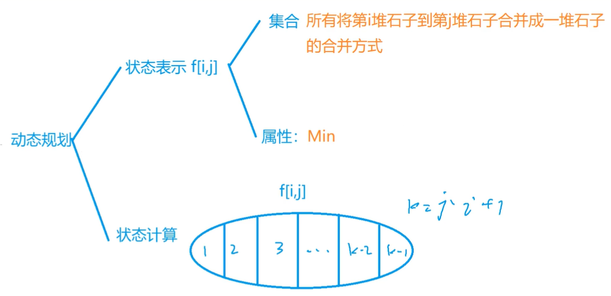
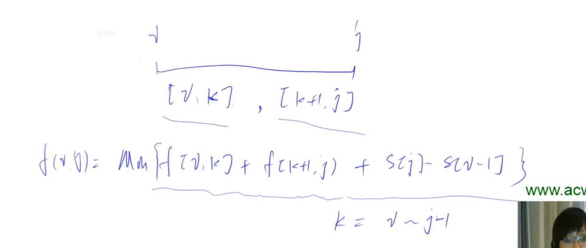

## 区间DP

要求整个区间的答案，可以把他分成求每个子区间的最优解，子区间同理划分。

当区间划分到最小时划分结束。然后每个子区间向上合并，算出原区间最优解，最终算出整个区间的答案。

上面是记忆化搜索的过程。不过我们写代码时一般直接从最小划分区间向上合并。

```cpp
for (int len = 2; len <= n; len++)           // 区间长度，1 没有意义，所以直接从 2 开始
    for (int i = 1; i + len - 1 <= n; i++) { // 枚举起点
        int j = i + len - 1;                 // 区间终点
        f[i][i] = 初始值;                     // 可以在这里赋初始值
        for (int k = i; k < j; k++) {        // 枚举分割点，构造状态转移方程
            f[i][j] = max(f[i][j], f[i][k] + f[k + 1][j] + w[i][j]);
        }
    }
```

### 1. 石子合并

[AcWing 282. 石子合并](https://www.acwing.com/problem/content/284/)

和贪心的区别：只能合并**相邻**的两堆，否则就是就是贪心问题。

思路：最后一次合并两个大堆。

状态转移方程：`f[i,j] = Min{ f[i,k] + f[k+1,j] + s[j] - s[i-1] }, k = i ~ j -1 `





```java
int main()
{
    scanf("%d", &n);
    for (int i = 1; i <= n; i++) 
    {
        scanf("%d", &s[i]);
        s[i] += s[i - 1];
    }

    for (int len = 2; len <= n; len++)
        for (int i = 1; i + len - 1 <= n; i++)
        {
            int j = i + len - 1;
            f[i][j] = 0x3f3f3f3f;
            for (int k = i; k < j; k++)
                f[i][j] = min(f[i][j], f[i][k] + f[k + 1][j] + s[j] - s[i - 1]);
        }
        
    printf("%d", f[1][n]);

    return 0;
}
```

### 2. 加分二叉树

[AcWing 479. 加分二叉树](https://www.acwing.com/problem/content/481/)


