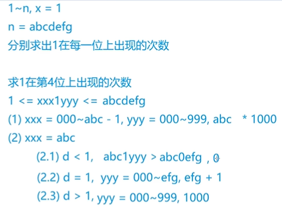

## 数位统计DP

[AcWing 338. 计数问题](https://www.acwing.com/problem/content/340/)

分情况讨论：

+ `count(n, x)` 表示在 `1~n` 中 x 出现的次数

+ `count(b, x) - count(a - 1, x)` 表示 `[a, b]` 中 x 出现的次数

举个例子：



可以不用讨论那么多细枝末节，只需要知道，**当 i 为0时其左边整数不能为0**，就够了。

**`a || l` 表示a是0的时候，a的左边不能为0。**

```c++
// x的位数
int get_num(int x)
{
    int res = 0;
    while (x)
    {
        res ++;
        x /= 10;
    }
    return res;
}

// 1 ~ x 中 a 的个数
int get_cnt(int x, int a)
{
    int d = get_num(x);
    int res = 0;
    for (int i = 1; i <= d; i++)
    {
        int p = pow(10, i - 1);
        int l = x / p / 10;  // 左边，相当于abc
        int r = x % p; // 右边，相当于efg
        int di = x / p % 10; // 从左到右第i位，相当于d
		
        if (a) res += p * l; // a不是0
        if (!a && l) res += (l - 1) * p; // a不是0且左边不为0

        // a || l表示a是0的时候，a的左边不能为0
        if (di == a && (a || l)) res += r + 1;
        if (di > a && (a || l)) res += p;
    }
    return res;
}
```

