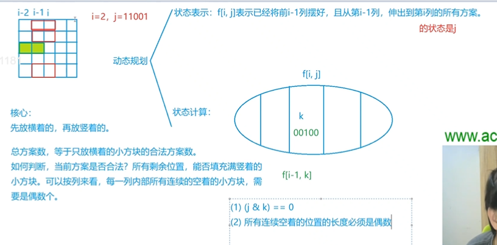

## 状态压缩DP

[AcWing 291. 蒙德里安的梦想](https://www.acwing.com/problem/content/293/)

所谓的状态压缩DP，就是用二进制数保存状态。为什么不直接用数组记录呢？因为用一个二进制数记录方便作位运算。

#### 1. 状态表示

状态表示：f\[i][j] 表示已经将前 i -1 列摆好，且从第 i−1 列，伸出到第 i 列的状态是 j 的所有方案。其中 j 是一个二进制数，用来表示哪一行的小方块是横着放的，其位数和棋盘的行数一致。





#### 2. 蒙德里安的梦想

+ 蒙德里安的梦想这题等价于找到所有横放 1 X 2 小方格的方案数，因为所有横放确定了，那么竖放方案是唯一的。用 f\[i][j] 记录第 i 列第 j 个状态。j 状态位等于 1 表示上一列有横放格子，本列有格子捅出来。
+ 转移方程很简单，本列的每一个状态都由上列所有“合法”状态转移过来 f\[i][j] += f\[i - 1][k]。两个转移条件：
  +  i 列和 i - 1列同一行不同时捅出来 ； 
  + 本列捅出来的状态 j 和上列捅出来的状态 k 求或，得到上列是否为奇数空行状态，奇数空行不转移。

 + 如何判断，当前方案数是否合法？ 所有剩余位置能否填充满竖着的小方块。可以按列来看，每一列内部所有连续的空着的小方块需要是偶数个。
 + 初始化条件 $f[0][0] = 1$，第 0 列只能是状态 0，无任何格子捅出来。返回 f\[m][0]。第 m + 1 列不能有东西捅出来。

```cpp
// 预处理状态数组 st
for (int i = 0; i < 1 << n; i++)
{
    int cnt = 0;
    st[i] = true;
    for (int j = 0; j < n; j++)
    {
        if (i >> j & 1)
        {
            // 在这个 1 前面有奇数个 0，不合法
            if (cnt & 1) st[i] = false;
            cnt = 0;
        }
        else cnt++;
    }
    if (cnt & 1) st[i] = false;
}


memset(f, 0, sizeof f);
f[0][0] = 1;
for (int i = 1; i <= m; i++)
    for (int j = 0; j < 1 << n; j++)
        for (int k = 0; k < 1 << n; k++)
            //  (j & k) == 0 表示 j 状态和 k 状态没有重叠的方块
            //  j | k表示在 i - 1 行横着的方块的位置，st[j | k] 表示 i 列和 i - 1 列是否合法（有无偶数个小块）
            if ((j & k) == 0 && st[j | k])
                f[i][j] += f[i - 1][k];

cout << f[m][0] << endl;
```

#### 3. 最短哈密尔顿路径


核心代码：

```cpp
/**
 * f[i][j]：表示从0点走到j点，路径是i的最短距离
 * 思路：遍历每一个k，使得可以从k走到j，使得f[][j]最小
 * 状态方程：f[i][j] = min(f[i][j], f[i - (1 << j)][k] + w[k][j]);
*/

memset(f, 0x3f, sizeof f);
f[1][0] = 0; // 走过第一个点
for (int i = 0; i < 1 << n; i++)
	for (int j = 0; j < n; j++)
		if (i >> j & 1) // 经过 j 点
			for (int k = 0; k < n; k++)
				if (i >> k & 1) // 经过 k 点
					f[i][j] = min(f[i][j], f[i - (1 << j)][k] + w[k][j]);

cout << f[(1 << n) - 1][n - 1] << endl;
```


