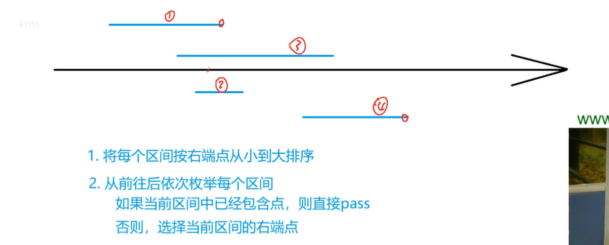
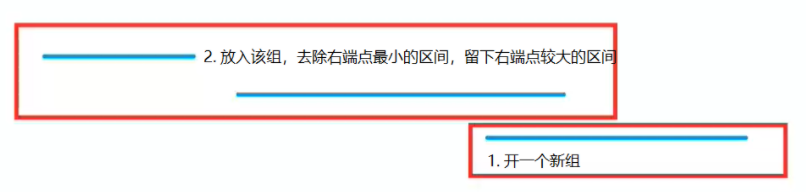

## 区间问题

区间问题的贪心一般都是上来先按左端点或者右端点排序；

然后手动模拟一下人脑怎么贪心的，看看能不能搞出来什么性质；

猜出来一个贪心策略的话多找几组样例试试正确性；

当然你能严格证明就能牛逼了，当你觉得他是贪心题的时候，千万不要轻易相信题目给的样例。

### 1. 区间选点

#### 1.1 `AcWing` 905. 区间选点

https://www.acwing.com/problem/content/907/



+ 将每个区间按照**右端点**从小到大进行排序
+ 从前往后枚举区间，ed值初始化为无穷小
  + 如果本次区间不能覆盖掉上次区间的左端点， `ed < range[i].l`；说明需要选择一个新的点， `res ++, ed = range[i].r`
  + 如果本次区间可以覆盖掉上次区间的左端点，则进行下一轮循环
+ 证明覆盖每一个区间至少需要 `cnt` 个点。
  + `ans <= cnt` ：`cnt` 是一种可行方案， ans 是可行方案的最优解，也就是最小值。
  + `ans >= cnt` ： `cnt` 可行方案是一个区间集合，区间从小到大排序，两两之间不相交。
+ 核心代码

```cpp
sort(range, range + n);

int res = 0, ed = -0x3f3f3f3f;
for (int i = 0; i < n; i++)
    if (ed < range[i].l)
    {
        ed = range[i].r;
        res++;
    }

```

#### 1.2 `AcWing` 908. 最大不相交区间数量

https://www.acwing.com/problem/content/910/

**最大不相交区间数 == 最少覆盖区间点数**

为什么最大不相交区间数 == 最少覆盖区间点数呢？因为如果几个区间能被同一个点覆盖，说明他们相交了。所以有几个点就是有几个不相交区间。

代码和 `AcWing` 905. 区间选点这一题的代码一摸一样。

#### 1.3 `AcWing` 906. 区间分组

https://www.acwing.com/problem/content/908/

最大区间厚度的问题。可以把这个问题想象成活动安排问题。有若干个活动，第 $i$ 个活动开始时间和结束时间是 $[S_i, f_i]$，同一个教室安排的活动之间不能交叠，求要安排所有活动，至少需要几个教室？

贪心决策:

+ 按左端点排序，从前往后枚举每个区间，判断此区间能否将其放到现有的组中；
+ 如果一个区间的左端点比最小组的右端点要小，`ranges[i].l <= heap.top()` ， 就开一个新组 `heap.push(range[i].r)`；
+ 如果一个区间的左端点比最小组的右端点要大，则放在该组， `heap.pop(), heap.push(range[i].r)`；



核心代码：

```cpp
sort(range, range + n);

priority_queue<int, vector<int>, greater<int>> q;
for (int i = 0; i < n; i++)
{
    Range t = range[i];
    if (q.empty() || t.l <= q.top()) q.push(t.r);
    else
    {
        q.pop();
        q.push(t.r);
    }
}
```

#### 1.4 `AcWing` 907. 区间覆盖

https://www.acwing.com/problem/content/909/

贪心策略：

+ 将所有区间按照左端点从小到大进行排序

+ 从前往后枚举每个区间，在所有能覆盖 start 的区间中，选择右端点的最大区间，然后将 start 更新成这个最大区间的右端点

核心代码：

```cpp
sort(range, range + n);
int res = 0;
for (int i = 0; i < n; i++)
{
    int j = i, r = -0x3f3f3f3f;
    while (j < n && range[j].l <= st) r = max(r, range[j++].r);

    i = j - 1;

    if (r < st) // 开头覆盖不了
    {
        res = -1;
        break;
    }

    res++;
    if (r >= ed) break; // 可以提前结束
    st = r;

    if (i == n - 1 && st < ed) // ed没有覆盖到
    {
        res = -1;
        break;
    }
}
```

