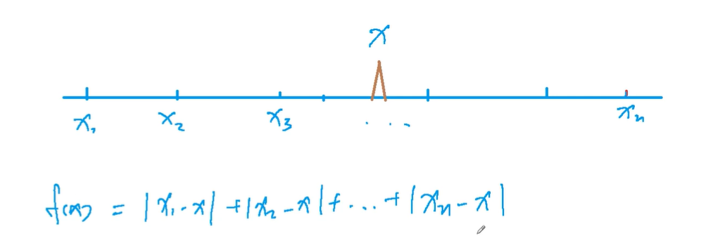

## 绝对值不等式

[AcWing 104. 货仓选址](https://www.acwing.com/problem/content/106/)

### 1. 算法思路

1. 把 $A[0]$ ~ $A[N-1]$ 排序，设货仓在 X 坐标处，X 左侧的商店有 P 家，右侧的商店有 Q 家。若 P < Q，则每把仓库的选址向右移动 1单位距离，距离之和就会变少Q - P。同理，若P > Q，则仓库的选址向左移动会使距离之和变小。当 P == Q 时为最优解。
2. 本质：中位数的性质。
3. 因此仓库应该建在中位数处，把 A 进行排序：

    + 当 N 为奇数时，货仓建在 $A[(N - 1)/2]$处；

    + 当 N 为偶数时，仓库建在 $A[(N - 1)/2 + 1]$ 处。



3. 时间复杂度：$O(nlog(n))$

### 2. 一般模板

```cpp
int n, res;
int a[N];

int main()
{
    scanf("%d", &n);
    for (int i = 0; i < n; i ++ ) scanf("%d", &a[i]);

    sort(a, a + n);

    for (int i = 0; i < n; i ++ ) res += abs(a[i] - a[n >> 1]);
    printf("%d\n", res);

    return 0;
}
```

