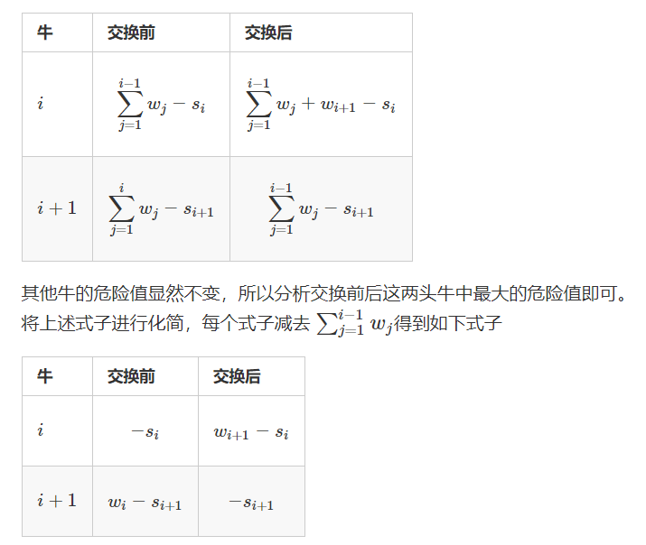

## 推公式

[AcWing 125. 耍杂技的牛](https://www.acwing.com/problem/content/127/)

### 1. 算法思路

直觉是 `S[i]+W[i]` 越大的放越下面。

与**国王游戏**的贪心策略相似， 我们先分析每头牛的危险值 = 他前面牛的w(重量值)和 - 自身的s(强壮值)，要使每头牛的危险值最小，这显然是与w 和 s同时相关，所以先 yy 出一种做法按每头牛的 w + s 进行升序排序（题见多了可能就会有这种题感）。

数学证明：



当 $w_i−s_{i+1}>=w_{i+1}−s_i$，即 $w_i+s_i>=w_{i+1}+s_{i+1}$ 时, 交换后更优；当 $w_i−s_{i+1}<w_{i+1}−s_i$，即 $w_i+s_i<w_{i+1}+s_{i+1}$ 时, 交换前更优。所以得到做法: 按每头牛的 $w + s$ 进行排序, 当存在逆序时就进行交换(即升序排序)，然后根据题意算出每头牛的危险值记录其中的最大值即可。

### 2. 算法模板

```cpp
int n;
struct Cow
{
    int w, s;
    bool operator<(const Cow &W) const
    {
        return w + s < W.w + W.s;  
    }
}cow[N];

int main()
{
    scanf("%d", &n);
    for (int i = 0; i < n; i++)
    {
        int w, s;
        scanf("%d%d", &w, &s);
        cow[i] = {w, s};
    }
    
    sort(cow, cow + n);
    
    int res = -0x3f3f3f3f, sum = 0;
    for (int i = 0; i < n; i++)
    {
        int w = cow[i].w, s = cow[i].s;
        res = max(res, sum - s);
        sum += w;
    }
    
    cout << res << endl;
    return 0;
}
```

